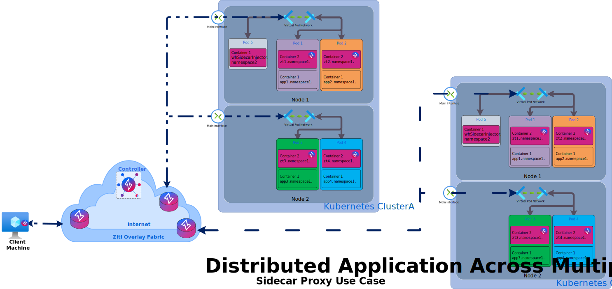
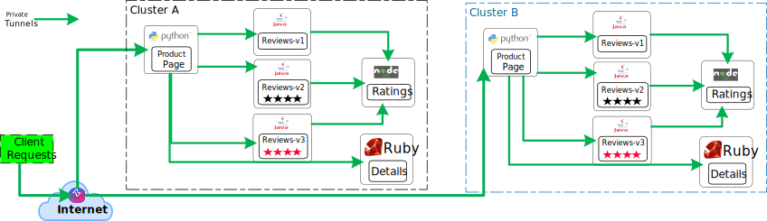
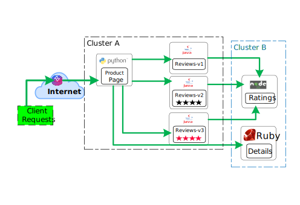
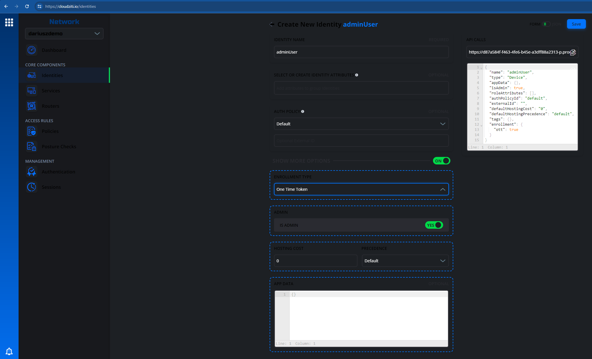
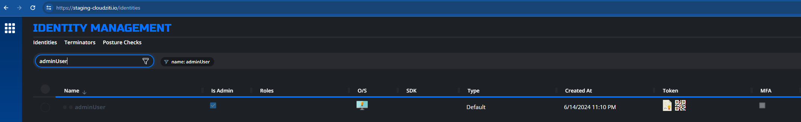
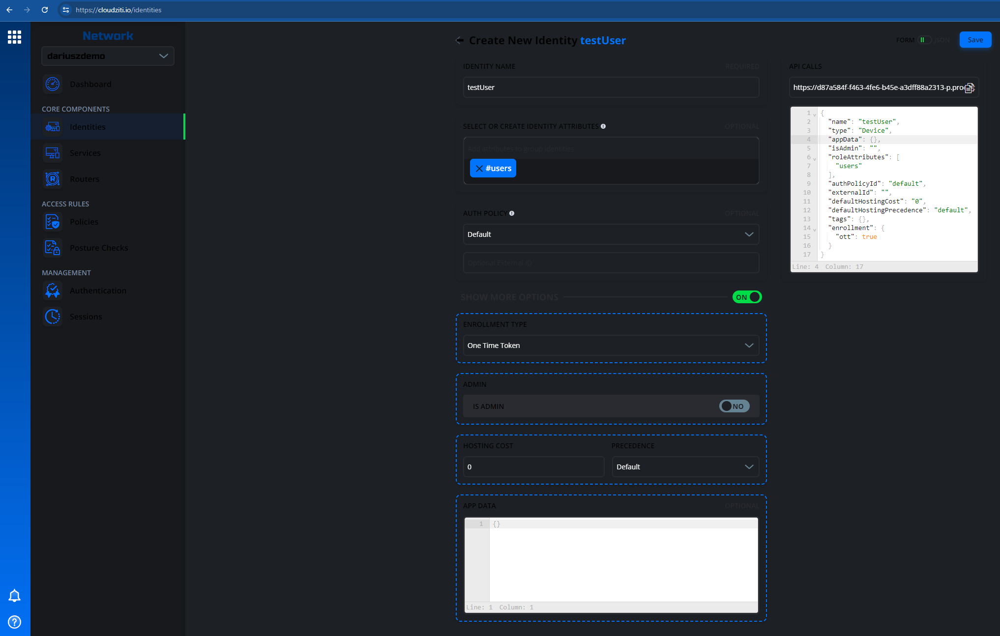
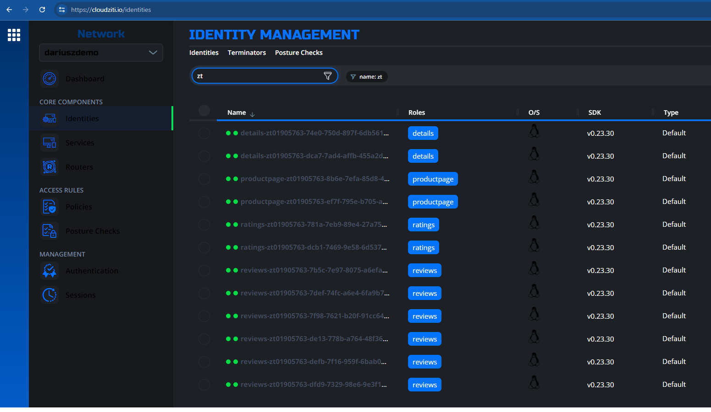
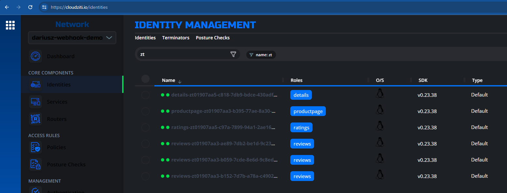
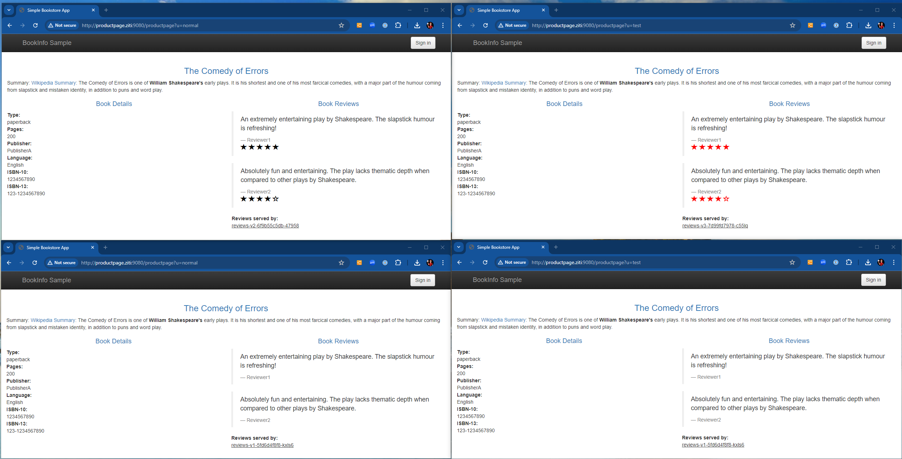
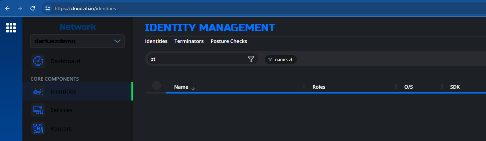

## Demo Description

<details><summary>Details</summary><p>

### Use Case Target

Cloud Native Aplications that are distributed over more than one region and are required to enforce granular access controls ensuring that only authorized users/microservices can interact with specific microservices at the pod level.

1. NetFoundry Proxy Sidecar - Use Case General View

    


1. Istio Bookinfo Application Example 

    1. Logical View - Identical replicas across clusters

    

    1. Logical View  - Microservices split across clusters

    


***Note: You can also watch the video where we talk about this demo to help you follow along and explain some of the details further. [Demo Video](https://youtu.be/X5gAs1nykG8)***

### Prerequisities:
Following binaries to be installed in the environment. 

If one uses this guide to deploy clusters to AWS and /or Google Cloud
1. [gcloud cli](https://cloud.google.com/sdk/docs/install)
1. [gcloud auth plugin](https://cloud.google.com/kubernetes-engine/docs/how-to/cluster-access-for-kubectl#install_plugin)
1. [eksctl cli](https://eksctl.io/installation/)
1. [aws cli](https://docs.aws.amazon.com/cli/latest/userguide/getting-started-install.html#getting-started-install-instructions)

Otherwise only these
1. [kubectl](https://kubernetes.io/docs/tasks/tools/#kubectl)
1. [ziti cli](https://github.com/openziti/ziti/releases)
1. [postman cli](https://learning.postman.com/docs/postman-cli/postman-cli-installation/)
1. [jq](https://jqlang.github.io/jq/download/)


### General Notes

1. Copy the code directly to the linux terminal to create required files/resources. 
1. One needs to [Export Existing Cluster Context Names](#export-cluster-context-names) as variables if skipping [Cluster(s) Deployment Section](#clusters-deployment). Kubectl commands will utilize them in the subsequent sections. FYI, EKS and GKE are just examples, but this can work in any K8S cluster, whether is private or public.

### Cluster Deployment Notes
1. In AWS, the VPC and network will be created part of `eksctl create cluster` command and one needs to have administrator permissions. 
1. Whereas in GKE, it is expected that VPC and network are already prebuilt. The service account is the part before @ and can be found under IAM-->Permissions, i.e. `{GKE_SERVICE_ACCOUNT}@{GKE_PROJECT_NAME}.iam.gserviceaccount.com`. The subnetwork is the subnet name and must be in the same region as indicated in GKE_REGION. 

</p></details>

## Cluster(s) Deployment

<details><summary>Details</summary><p>

### Export EKS/GKE Details

```shell
export CLUSTER_NAME="Name can be anything"
export AWS_PROFILE="Name can be anything"
export AWS_SSO_ACCOUNT_ID="Your actaul Account ID"
export AWS_SSO_SESSION="Name can be anything"
export AWS_SSO_START_URL="Your actual SSO start URL"
export AWS_SSO_REGION="Region where your SSO was set up"
export AWS_REGION="Region where cluster to be deployed"
export GKE_PROJECT_NAME="Your actual Project Name"
export GKE_NETWORK_NAME="The actual Network Name within your Project"
export GKE_SUBNETWORK_NAME="The actual Subnet Name within the above Network"
export GKE_SERVICE_ACCOUNT="The service account within the Project, i.e. {GKE_SERVICE_ACCOUNT}@"
export GKE_REGION="The region where the above subnet is configured"
```

### AWS

1. Create AWS Profiles if not done already
    
    ***Note: May have to create ~/.aws folder first.***

    <details><summary>Code</summary><p>

    ```shell
    cat <<EOF >~/.aws/config
      [sso-session ${AWS_SSO_SESSION}]
      sso_start_url = ${AWS_SSO_START_URL}
      sso_region = ${AWS_SSO_REGION}
      sso_registration_scopes = sso:account:access
      [profile ${AWS_PROFILE}]
      sso_session = ${AWS_SSO_SESSION}
      sso_account_id = ${AWS_SSO_ACCOUNT_ID}
      sso_role_name = Administrator
      region = us-east-2
      output = json
      [default]
      region = us-east-2
    EOF
    ```

    </p></details>

1. Login with SSO

    ```shell
    aws sso login --profile $AWS_PROFILE
    ```
    If can not launch browser from terminal
    ```shell
    aws sso login --profile $AWS_PROFILE --no-browser
    ```
    
1. Create cluster config template

    <details><summary>Code</summary><p>

    ```shell
    cat <<EOF >eks-cluster.yaml
    apiVersion: eksctl.io/v1alpha5
    kind: ClusterConfig
    metadata:
      name: ${CLUSTER_NAME}
      region: ${AWS_REGION}
      version: "1.28"
    managedNodeGroups:
    - name: ng-1
      instanceType: t3.medium
      iam:
          withAddonPolicies:
            ebs: true
            fsx: true
            efs: true
      desiredCapacity: 2
      privateNetworking: true
      labels:
        nodegroup-type: workloads
      tags:
        nodegroup-role: worker
    vpc:
      cidr: 10.10.0.0/16
      publicAccessCIDRs: []
      # disable public access to endpoint and only allow private access
      clusterEndpoints:
        publicAccess: true
        privateAccess: true
    EOF
    ```

    </p></details>

1. Create cluster
    ```shell
    eksctl create cluster -f ./eks-cluster.yaml --profile $AWS_PROFILE
    ```

### GCLOUD
1. Login
    ```shell
    gcloud auth login
    ```
    If can not launch browser from terminal
    ```shell
    gcloud auth login --no-browser
    ````
1. Create cluster
    ```shell
    gcloud container --project $GKE_PROJECT_NAME clusters create $CLUSTER_NAME \
      --region $GKE_REGION --no-enable-basic-auth \
      --release-channel "regular" --machine-type "e2-medium" \
      --image-type "COS_CONTAINERD" --disk-type "pd-balanced" \
      --disk-size "100" --metadata disable-legacy-endpoints=true \
      --service-account "$GKE_SERVICE_ACCOUNT@$GKE_PROJECT_NAME.iam.gserviceaccount.com" \
      --logging=SYSTEM,WORKLOAD --monitoring=SYSTEM --enable-ip-alias \
      --network "projects/$GKE_PROJECT_NAME/global/networks/$GKE_NETWORK_NAME" \
      --subnetwork "projects/$GKE_PROJECT_NAME/regions/$GKE_REGION/subnetworks/$GKE_SUBNETWORK_NAME" \
      --no-enable-intra-node-visibility --cluster-dns=clouddns --cluster-dns-scope=cluster \
      --default-max-pods-per-node "110" --security-posture=standard \
      --workload-vulnerability-scanning=disabled --no-enable-master-authorized-networks \
      --addons HorizontalPodAutoscaling,NodeLocalDNS,GcePersistentDiskCsiDriver \
      --enable-autoupgrade --enable-autorepair --max-surge-upgrade 1 \
      --max-unavailable-upgrade 0 --binauthz-evaluation-mode=DISABLED \
      --enable-managed-prometheus --enable-shielded-nodes --num-nodes "1"
    ```

</p></details>

## Export Cluster Context Names

<details><summary>Details</summary><p>

If you have your own clusters, then you need to replace the dynamic cluster name search to actual cluster names, i.e. `export AWS_CLUSTER={your cluster context name}`, etc.
```shell
export AWS_CLUSTER=`kubectl config get-contexts -o name | grep $CLUSTER_NAME | grep eksctl`
export GKE_CLUSTER=`kubectl config get-contexts -o name | grep $CLUSTER_NAME | grep gke`
```

</p></details>

## NetFoundry Components Deployment

<details><summary>Details</summary><p>

If you have the NF Console API credentials file in your test environment, then you should choose the API section, otherwise skip to the NF Console and API section.

### Create Network and Services - NF API

  <details><summary>Steps</summary><p>

1. Export your NF API Credentials File path.

    ```shell
      export NF_API_CREDENTIALS_PATH="/path/to/your/netfoundry api credentials file"
      export NF_NETWORK_NAME="Your Demo Network Name"
    ```

1. Copy the code into a terminal to create Postman collection file

    <details><summary>Code</summary><p>

    ```shell
    cat <<EOF >nf-network-services-create.postman_collection.json
    {
      "info": {
        "_postman_id": "d81c56cc-f00e-4785-91ff-775c21e89ea0",
        "name": "nf-network-services-create",
        "schema": "https://schema.getpostman.com/json/collection/v2.1.0/collection.json",
        "_exporter_id": "3145648"
      },
      "item": [
        {
          "name": "GetTokenFromCognito",
          "event": [
            {
              "listen": "prerequest",
              "script": {
                "exec": [
                  ""
                ],
                "type": "text/javascript",
                "packages": {}
              }
            },
            {
              "listen": "test",
              "script": {
                "exec": [
                  "const jsonData = pm.response.json();",
                  "pm.globals.set(\"jwt_token\", jsonData.access_token);",
                  "pm.globals.set(\"jwt_type\", jsonData.token_type);"
                ],
                "type": "text/javascript",
                "packages": {}
              }
            }
          ],
          "request": {
            "auth": {
              "type": "basic",
              "basic": [
                {
                  "key": "password",
                  "value": "{{client_secret}}",
                  "type": "string"
                },
                {
                  "key": "username",
                  "value": "{{client_id}}",
                  "type": "string"
                }
              ]
            },
            "method": "POST",
            "header": [
              {
                "key": "Content-Type",
                "value": "application/x-www-form-urlencoded"
              }
            ],
            "body": {
              "mode": "urlencoded",
              "urlencoded": [
                {
                  "key": "grant_type",
                  "value": "client_credentials",
                  "type": "text"
                },
                {
                  "key": "scope",
                  "value": "",
                  "type": "text"
                }
              ]
            },
            "url": {
              "raw": "{{token}}",
              "host": [
                "{{token}}"
              ]
            }
          },
          "response": []
        },
        {
          "name": "CreateNetwork",
          "event": [
            {
              "listen": "test",
              "script": {
                "exec": [
                  "const jsonData = pm.response.json();\r",
                  "pm.globals.set('networkId', jsonData.id)"
                ],
                "type": "text/javascript",
                "packages": {}
              }
            }
          ],
          "request": {
            "method": "POST",
            "header": [
              {
                "key": "Content-Type",
                "value": "application/json"
              },
              {
                "key": "NF-OrganizationId",
                "value": "a645e9ce-e49f-49f2-a6f8-6369822dd412"
              }
            ],
            "body": {
              "mode": "raw",
              "raw": "{\n  \"networkGroupId\": \"bce07cd1-8f36-44a3-b279-26426e7a53ef\",\n  \"name\" : \"{{networkName}}\",\n  \"provider\": \"AWS\",\n  \"size\" : \"medium\",\n  \"region\" : \"us-east-2\"\n}"
            },
            "url": {
              "raw": "{{api}}/networks",
              "host": [
                "{{api}}"
              ],
              "path": [
                "networks"
              ]
            }
          },
          "response": []
        },
        {
          "name": "GetNetwork",
          "event": [
            {
              "listen": "test",
              "script": {
                "exec": [
                  "pm.test(\"Repeating request with capture (recursive)\", function () {\r",
                  "  let repetitions = 200;\r",
                  "  let delayInMilliseconds = 10000;\r",
                  "  let currentIteration = 1;\r",
                  "\r",
                  "  function handleResponse(err, response) {\r",
                  "    if (err) {\r",
                  "        console.error(\"Request failed:\", err);\r",
                  "        return;\r",
                  "    }\r",
                  "    console.log(\"Iteration\", currentIteration, \"Date createdAt:\", response.json().createdAt, \"Date nowAt:\", response.headers.get(\"Date\"), \"Status:\", response.json().status); \r",
                  "    if (response.json().status === \"PROVISIONED\") {\r",
                  "        repetitions = 0;\r",
                  "    }\r",
                  "  }\r",
                  "\r",
                  "  function repeatRequest() {\r",
                  "    \r",
                  "    pm.sendRequest(pm.request, handleResponse);\r",
                  "    if (currentIteration > repetitions) {\r",
                  "      return;\r",
                  "    }\r",
                  "\r",
                  "    setTimeout(function() {\r",
                  "      currentIteration++;\r",
                  "      repeatRequest(); \r",
                  "    }, delayInMilliseconds);\r",
                  "  }\r",
                  "\r",
                  "  repeatRequest();\r",
                  "});\r",
                  "\r",
                  ""
                ],
                "type": "text/javascript",
                "packages": {}
              }
            },
            {
              "listen": "prerequest",
              "script": {
                "exec": [
                  ""
                ],
                "type": "text/javascript",
                "packages": {}
              }
            }
          ],
          "request": {
            "method": "GET",
            "header": [
              {
                "key": "Content-Type",
                "value": "application/json"
              }
            ],
            "url": {
              "raw": "{{api}}/networks/{{networkId}}",
              "host": [
                "{{api}}"
              ],
              "path": [
                "networks",
                "{{networkId}}"
              ]
            }
          },
          "response": []
        },
        {
          "name": "NetworkExchange",
          "event": [
            {
              "listen": "test",
              "script": {
                "exec": [
                  "const jsonData = pm.response.json();\r",
                  "pm.globals.set('api_token', jsonData.value)\r",
                  "pm.globals.set('controller-api-endpoint', jsonData.networkControllerUrl)"
                ],
                "type": "text/javascript",
                "packages": {}
              }
            },
            {
              "listen": "prerequest",
              "script": {
                "exec": [
                  ""
                ],
                "type": "text/javascript",
                "packages": {}
              }
            }
          ],
          "request": {
            "method": "POST",
            "header": [
              {
                "key": "Content-Type",
                "value": "application/json"
              },
              {
                "key": "NF-OrganizationId",
                "value": "a645e9ce-e49f-49f2-a6f8-6369822dd412"
              }
            ],
            "body": {
              "mode": "raw",
              "raw": "{\n  \"type\": \"session\"\n}"
            },
            "url": {
              "raw": "{{api}}/networks/{{networkId}}/exchange",
              "host": [
                "{{api}}"
              ],
              "path": [
                "networks",
                "{{networkId}}",
                "exchange"
              ]
            }
          },
          "response": []
        },
        {
          "name": "Create Edge Router Ziti",
          "event": [
            {
              "listen": "test",
              "script": {
                "exec": [
                  "const jsonData = pm.response.json();\r",
                  "pm.globals.set('edgeRouterId', jsonData.data.id)"
                ],
                "type": "text/javascript",
                "packages": {}
              }
            },
            {
              "listen": "prerequest",
              "script": {
                "packages": {},
                "type": "text/javascript"
              }
            }
          ],
          "request": {
            "method": "POST",
            "header": [
              {
                "key": "Content-Type",
                "value": "application/json"
              },
              {
                "key": "zt-session",
                "value": "{{api_token}}"
              }
            ],
            "body": {
              "mode": "raw",
              "raw": "{\r\n  \"name\": \"Public-AWS-Router-01\",\r\n  \"appData\": {},\r\n  \"roleAttributes\": [\r\n    \"public\"\r\n  ],\r\n  \"isTunnelerEnabled\": false,\r\n  \"noTraversal\": false,\r\n  \"cost\": 0,\r\n  \"tags\": {},\r\n  \"enrollment\": {\r\n    \"ott\": true\r\n  }\r\n}"
            },
            "url": {
              "raw": "{{controller-api-endpoint}}/edge-routers",
              "host": [
                "{{controller-api-endpoint}}"
              ],
              "path": [
                "edge-routers"
              ]
            }
          },
          "response": []
        },
        {
          "name": "Create Edge Router MOP",
          "event": [
            {
              "listen": "test",
              "script": {
                "exec": [
                  "const jsonData = pm.response.json();\r",
                  "pm.globals.set('mopEdgeRouterId', jsonData.id)"
                ],
                "type": "text/javascript",
                "packages": {}
              }
            }
          ],
          "request": {
            "auth": {
              "type": "bearer",
              "bearer": [
                {
                  "key": "token",
                  "value": "{{jwt_token}}",
                  "type": "string"
                }
              ]
            },
            "method": "POST",
            "header": [
              {
                "key": "Content-Type",
                "value": "application/json"
              }
            ],
            "body": {
              "mode": "raw",
              "raw": "{\n  \"name\": \"Public-AWS-Router-01\",\n  \"networkId\": \"{{networkId}}\",\n  \"zitiId\": \"{{edgeRouterId}}\",\n  \"provider\": \"AWS\",\n  \"region\": \"us-east-2\",\n  \"linkListener\": true,\n  \"wssListener\": false\n}"
            },
            "url": {
              "raw": "{{api}}/edge-routers",
              "host": [
                "{{api}}"
              ],
              "path": [
                "edge-routers"
              ]
            }
          },
          "response": []
        },
        {
          "name": "Create Admin Identity",
          "event": [
            {
              "listen": "test",
              "script": {
                "exec": [
                  "const jsonData = pm.response.json();\r",
                  "pm.globals.set('adminIdentityId', jsonData.data.id)"
                ],
                "type": "text/javascript",
                "packages": {}
              }
            },
            {
              "listen": "prerequest",
              "script": {
                "exec": [
                  ""
                ],
                "type": "text/javascript",
                "packages": {}
              }
            }
          ],
          "request": {
            "method": "POST",
            "header": [
              {
                "key": "Content-Type",
                "value": "application/json"
              },
              {
                "key": "zt-session",
                "value": "{{api_token}}"
              }
            ],
            "body": {
              "mode": "raw",
              "raw": "{\r\n  \"name\": \"adminUser\",\r\n  \"type\": \"Device\",\r\n  \"appData\": {},\r\n  \"isAdmin\": true,\r\n  \"roleAttributes\": [],\r\n  \"authPolicyId\": \"default\",\r\n  \"tags\": {},\r\n  \"enrollment\": {\r\n    \"ott\": true\r\n  }\r\n}"
            },
            "url": {
              "raw": "{{controller-api-endpoint}}/identities",
              "host": [
                "{{controller-api-endpoint}}"
              ],
              "path": [
                "identities"
              ]
            }
          },
          "response": []
        },
        {
          "name": "Create Client Identity",
          "event": [
            {
              "listen": "test",
              "script": {
                "exec": [
                  "const jsonData = pm.response.json();\r",
                  "pm.globals.set('clientIdentityId', jsonData.data.id)\r",
                  ""
                ],
                "type": "text/javascript",
                "packages": {}
              }
            },
            {
              "listen": "prerequest",
              "script": {
                "exec": [
                  ""
                ],
                "type": "text/javascript",
                "packages": {}
              }
            }
          ],
          "request": {
            "method": "POST",
            "header": [
              {
                "key": "Content-Type",
                "value": "application/json"
              },
              {
                "key": "zt-session",
                "value": "{{api_token}}"
              }
            ],
            "body": {
              "mode": "raw",
              "raw": "{\r\n  \"name\": \"testUser\",\r\n  \"type\": \"Device\",\r\n  \"appData\": {},\r\n  \"isAdmin\": false,\r\n  \"roleAttributes\": [\r\n    \"users\"\r\n  ],\r\n  \"authPolicyId\": \"default\",\r\n  \"tags\": {},\r\n  \"enrollment\": {\r\n    \"ott\": true\r\n  }\r\n}"
            },
            "url": {
              "raw": "{{controller-api-endpoint}}/identities",
              "host": [
                "{{controller-api-endpoint}}"
              ],
              "path": [
                "identities"
              ]
            }
          },
          "response": []
        },
        {
          "name": "Get Admin Identity JWT",
          "event": [
            {
              "listen": "test",
              "script": {
                "exec": [
                  "const jsonData = pm.response.json();\r",
                  "pm.globals.set('adminIdentityJwt', jsonData.data.enrollment.ott.jwt)"
                ],
                "type": "text/javascript",
                "packages": {}
              }
            },
            {
              "listen": "prerequest",
              "script": {
                "exec": [
                  ""
                ],
                "type": "text/javascript",
                "packages": {}
              }
            }
          ],
          "protocolProfileBehavior": {
            "disableBodyPruning": true
          },
          "request": {
            "method": "GET",
            "header": [
              {
                "key": "Content-Type",
                "value": "application/json"
              },
              {
                "key": "zt-session",
                "value": "{{api_token}}"
              }
            ],
            "body": {
              "mode": "raw",
              "raw": ""
            },
            "url": {
              "raw": "{{controller-api-endpoint}}/identities/{{adminIdentityId}}",
              "host": [
                "{{controller-api-endpoint}}"
              ],
              "path": [
                "identities",
                "{{adminIdentityId}}"
              ]
            }
          },
          "response": []
        },
        {
          "name": "Get Client Identity JWT",
          "event": [
            {
              "listen": "test",
              "script": {
                "exec": [
                  "const jsonData = pm.response.json();\r",
                  "pm.globals.set('clientIdentityJwt', jsonData.data.enrollment.ott.jwt)"
                ],
                "type": "text/javascript",
                "packages": {}
              }
            },
            {
              "listen": "prerequest",
              "script": {
                "exec": [
                  ""
                ],
                "type": "text/javascript",
                "packages": {}
              }
            }
          ],
          "protocolProfileBehavior": {
            "disableBodyPruning": true
          },
          "request": {
            "method": "GET",
            "header": [
              {
                "key": "Content-Type",
                "value": "application/json"
              },
              {
                "key": "zt-session",
                "value": "{{api_token}}"
              }
            ],
            "body": {
              "mode": "raw",
              "raw": ""
            },
            "url": {
              "raw": "{{controller-api-endpoint}}/identities/{{clientIdentityId}}",
              "host": [
                "{{controller-api-endpoint}}"
              ],
              "path": [
                "identities",
                "{{clientIdentityId}}"
              ]
            }
          },
          "response": []
        },
        {
          "name": "Configs",
          "item": [
            {
              "name": "Post Config Details Host",
              "event": [
                {
                  "listen": "test",
                  "script": {
                    "exec": [
                      "const jsonData = pm.response.json();\r",
                      "postman.setEnvironmentVariable('hostConfigId1', jsonData.data.id)"
                    ],
                    "type": "text/javascript",
                    "packages": {}
                  }
                }
              ],
              "request": {
                "method": "POST",
                "header": [
                  {
                    "key": "Content-Type",
                    "value": "application/json"
                  },
                  {
                    "key": "zt-session",
                    "value": "{{api_token}}"
                  }
                ],
                "body": {
                  "mode": "raw",
                  "raw": "{\r\n    \"name\": \"details.host.v1\",\r\n    \"configTypeId\": \"NH5p4FpGR\",\r\n    \"data\": {\r\n        \"address\": \"127.0.0.1\",\r\n        \"allowedPortRanges\": [\r\n            {\r\n                \"high\": 9080,\r\n                \"low\": 9080\r\n            }\r\n        ],\r\n        \"allowedProtocols\": [\r\n            \"tcp\"\r\n        ],\r\n        \"forwardPort\": true,\r\n        \"forwardProtocol\": true,\r\n        \"listenOptions\": {\r\n            \"bindUsingEdgeIdentity\": false,\r\n            \"connectTimeout\": \"1s\",\r\n            \"connectTimeoutSeconds\": 1,\r\n            \"identity\": \"\",\r\n            \"precedence\": \"default\"\r\n        }\r\n    }\r\n}"
                },
                "url": {
                  "raw": "{{controller-api-endpoint}}/configs/",
                  "host": [
                    "{{controller-api-endpoint}}"
                  ],
                  "path": [
                    "configs",
                    ""
                  ]
                }
              },
              "response": []
            },
            {
              "name": "Post Config Details Intercept",
              "event": [
                {
                  "listen": "test",
                  "script": {
                    "exec": [
                      "const jsonData = pm.response.json();\r",
                      "postman.setEnvironmentVariable('interceptConfigId1', jsonData.data.id)"
                    ],
                    "type": "text/javascript",
                    "packages": {}
                  }
                }
              ],
              "request": {
                "method": "POST",
                "header": [
                  {
                    "key": "Content-Type",
                    "value": "application/json"
                  },
                  {
                    "key": "zt-session",
                    "value": "{{api_token}}"
                  }
                ],
                "body": {
                  "mode": "raw",
                  "raw": "{\r\n  \"name\":\"details.intercept.v1\",\r\n  \"configTypeId\": \"g7cIWbcGg\",\r\n  \"data\":{\r\n    \"addresses\":[\r\n      \"details\"],\r\n    \"dialOptions\":{\r\n      \"identity\":\"\"\r\n    },\r\n    \"portRanges\":[\r\n      {\r\n        \"high\":9080,\r\n        \"low\":9080\r\n      }],\r\n    \"protocols\":[\r\n      \"tcp\"],\r\n    \"sourceIp\":\"\"\r\n  }\r\n}\r\n\r\n\r\n\r\n"
                },
                "url": {
                  "raw": "{{controller-api-endpoint}}/configs/",
                  "host": [
                    "{{controller-api-endpoint}}"
                  ],
                  "path": [
                    "configs",
                    ""
                  ]
                }
              },
              "response": []
            },
            {
              "name": "Post Config Productpage Host",
              "event": [
                {
                  "listen": "test",
                  "script": {
                    "exec": [
                      "const jsonData = pm.response.json();\r",
                      "postman.setEnvironmentVariable('hostConfigId2', jsonData.data.id)"
                    ],
                    "type": "text/javascript",
                    "packages": {}
                  }
                }
              ],
              "request": {
                "method": "POST",
                "header": [
                  {
                    "key": "Content-Type",
                    "value": "application/json"
                  },
                  {
                    "key": "zt-session",
                    "value": "{{api_token}}"
                  }
                ],
                "body": {
                  "mode": "raw",
                  "raw": "{\r\n  \"name\":\"productpage.host.v1\",\r\n  \"configTypeId\": \"NH5p4FpGR\",\r\n  \"data\":{\r\n    \"address\":\"127.0.0.1\",\r\n    \"allowedPortRanges\":[\r\n      {\r\n        \"high\":9080,\r\n        \"low\":9080\r\n      }],\r\n    \"allowedProtocols\":[\r\n      \"tcp\"],\r\n    \"forwardPort\":true,\r\n    \"forwardProtocol\":true,\r\n    \"listenOptions\":{\r\n      \"bindUsingEdgeIdentity\":false,\r\n      \"connectTimeout\":\"1s\",\r\n      \"connectTimeoutSeconds\":1,\r\n      \"identity\":\"\",\r\n      \"precedence\":\"default\"\r\n    }\r\n  }\r\n}\r\n\r\n\r\n\r\n"
                },
                "url": {
                  "raw": "{{controller-api-endpoint}}/configs/",
                  "host": [
                    "{{controller-api-endpoint}}"
                  ],
                  "path": [
                    "configs",
                    ""
                  ]
                }
              },
              "response": []
            },
            {
              "name": "Post Config Productpage Intercept",
              "event": [
                {
                  "listen": "test",
                  "script": {
                    "exec": [
                      "const jsonData = pm.response.json();\r",
                      "postman.setEnvironmentVariable('interceptConfigId2', jsonData.data.id)"
                    ],
                    "type": "text/javascript",
                    "packages": {}
                  }
                }
              ],
              "request": {
                "method": "POST",
                "header": [
                  {
                    "key": "Content-Type",
                    "value": "application/json"
                  },
                  {
                    "key": "zt-session",
                    "value": "{{api_token}}"
                  }
                ],
                "body": {
                  "mode": "raw",
                  "raw": "{\r\n  \"name\":\"productpage.intercept.v1\",\r\n  \"configTypeId\": \"g7cIWbcGg\",\r\n  \"data\":{\r\n    \"addresses\":[\r\n      \"productpage.ziti\"],\r\n    \"dialOptions\":{\r\n      \"identity\":\"\"\r\n    },\r\n    \"portRanges\":[\r\n      {\r\n        \"high\":9080,\r\n        \"low\":9080\r\n      }],\r\n    \"protocols\":[\r\n      \"tcp\"],\r\n    \"sourceIp\":\"\"\r\n  }\r\n}\r\n\r\n\r\n"
                },
                "url": {
                  "raw": "{{controller-api-endpoint}}/configs/",
                  "host": [
                    "{{controller-api-endpoint}}"
                  ],
                  "path": [
                    "configs",
                    ""
                  ]
                }
              },
              "response": []
            },
            {
              "name": "Post Config Ratings Host",
              "event": [
                {
                  "listen": "test",
                  "script": {
                    "exec": [
                      "const jsonData = pm.response.json();\r",
                      "postman.setEnvironmentVariable('hostConfigId3', jsonData.data.id)"
                    ],
                    "type": "text/javascript",
                    "packages": {}
                  }
                }
              ],
              "request": {
                "method": "POST",
                "header": [
                  {
                    "key": "Content-Type",
                    "value": "application/json"
                  },
                  {
                    "key": "zt-session",
                    "value": "{{api_token}}"
                  }
                ],
                "body": {
                  "mode": "raw",
                  "raw": "{\r\n  \"name\":\"ratings.host.v1\",\r\n  \"configTypeId\": \"NH5p4FpGR\",\r\n  \"data\":{\r\n    \"address\":\"127.0.0.1\",\r\n    \"allowedPortRanges\":[\r\n      {\r\n        \"high\":9080,\r\n        \"low\":9080\r\n      }],\r\n    \"allowedProtocols\":[\r\n      \"tcp\"],\r\n    \"forwardPort\":true,\r\n    \"forwardProtocol\":true,\r\n    \"listenOptions\":{\r\n      \"bindUsingEdgeIdentity\":false,\r\n      \"connectTimeout\":\"1s\",\r\n      \"connectTimeoutSeconds\":1,\r\n      \"identity\":\"\",\r\n      \"precedence\":\"default\"\r\n    }\r\n  }\r\n}\r\n\r\n\r\n"
                },
                "url": {
                  "raw": "{{controller-api-endpoint}}/configs/",
                  "host": [
                    "{{controller-api-endpoint}}"
                  ],
                  "path": [
                    "configs",
                    ""
                  ]
                }
              },
              "response": []
            },
            {
              "name": "Post Config Ratings Intercept",
              "event": [
                {
                  "listen": "test",
                  "script": {
                    "exec": [
                      "const jsonData = pm.response.json();\r",
                      "postman.setEnvironmentVariable('interceptConfigId3', jsonData.data.id)"
                    ],
                    "type": "text/javascript",
                    "packages": {}
                  }
                }
              ],
              "request": {
                "method": "POST",
                "header": [
                  {
                    "key": "Content-Type",
                    "value": "application/json"
                  },
                  {
                    "key": "zt-session",
                    "value": "{{api_token}}"
                  }
                ],
                "body": {
                  "mode": "raw",
                  "raw": "{\r\n  \"name\":\"ratings.intercept.v1\",\r\n  \"configTypeId\": \"g7cIWbcGg\",\r\n  \"data\":{\r\n    \"addresses\":[\r\n      \"ratings\"],\r\n    \"dialOptions\":{\r\n      \"identity\":\"\"\r\n    },\r\n    \"portRanges\":[\r\n      {\r\n        \"high\":9080,\r\n        \"low\":9080\r\n      }],\r\n    \"protocols\":[\r\n      \"tcp\"],\r\n    \"sourceIp\":\"\"\r\n  }\r\n}\r\n\r\n\r\n\r\n"
                },
                "url": {
                  "raw": "{{controller-api-endpoint}}/configs/",
                  "host": [
                    "{{controller-api-endpoint}}"
                  ],
                  "path": [
                    "configs",
                    ""
                  ]
                }
              },
              "response": []
            },
            {
              "name": "Post Config Reviews Host",
              "event": [
                {
                  "listen": "test",
                  "script": {
                    "exec": [
                      "const jsonData = pm.response.json();\r",
                      "postman.setEnvironmentVariable('hostConfigId4', jsonData.data.id)"
                    ],
                    "type": "text/javascript",
                    "packages": {}
                  }
                }
              ],
              "request": {
                "method": "POST",
                "header": [
                  {
                    "key": "Content-Type",
                    "value": "application/json"
                  },
                  {
                    "key": "zt-session",
                    "value": "{{api_token}}"
                  }
                ],
                "body": {
                  "mode": "raw",
                  "raw": "{\r\n  \"name\":\"reviews.host.v1\",\r\n  \"configTypeId\": \"NH5p4FpGR\",\r\n  \"data\":{\r\n    \"address\":\"127.0.0.1\",\r\n    \"allowedPortRanges\":[\r\n      {\r\n        \"high\":9080,\r\n        \"low\":9080\r\n      }],\r\n    \"allowedProtocols\":[\r\n      \"tcp\"],\r\n    \"forwardPort\":true,\r\n    \"forwardProtocol\":true,\r\n    \"listenOptions\":{\r\n      \"bindUsingEdgeIdentity\":false,\r\n      \"connectTimeout\":\"1s\",\r\n      \"connectTimeoutSeconds\":1,\r\n      \"identity\":\"\",\r\n      \"precedence\":\"default\"\r\n    }\r\n  }\r\n}\r\n\r\n\r\n\r\n"
                },
                "url": {
                  "raw": "{{controller-api-endpoint}}/configs/",
                  "host": [
                    "{{controller-api-endpoint}}"
                  ],
                  "path": [
                    "configs",
                    ""
                  ]
                }
              },
              "response": []
            },
            {
              "name": "Post Config Reviews Intercept",
              "event": [
                {
                  "listen": "test",
                  "script": {
                    "exec": [
                      "const jsonData = pm.response.json();\r",
                      "postman.setEnvironmentVariable('interceptConfigId4', jsonData.data.id)"
                    ],
                    "type": "text/javascript",
                    "packages": {}
                  }
                }
              ],
              "request": {
                "method": "POST",
                "header": [
                  {
                    "key": "Content-Type",
                    "value": "application/json"
                  },
                  {
                    "key": "zt-session",
                    "value": "{{api_token}}"
                  }
                ],
                "body": {
                  "mode": "raw",
                  "raw": "{\r\n  \"name\":\"reviews.intercept.v1\",\r\n  \"configTypeId\": \"g7cIWbcGg\",\r\n  \"data\":{\r\n    \"addresses\":[\r\n      \"reviews\"],\r\n    \"dialOptions\":{\r\n      \"identity\":\"\"\r\n    },\r\n    \"portRanges\":[\r\n      {\r\n        \"high\":9080,\r\n        \"low\":9080\r\n      }],\r\n    \"protocols\":[\r\n      \"tcp\"],\r\n    \"sourceIp\":\"\"\r\n  }\r\n}\r\n\r\n\r\n\r\n"
                },
                "url": {
                  "raw": "{{controller-api-endpoint}}/configs/",
                  "host": [
                    "{{controller-api-endpoint}}"
                  ],
                  "path": [
                    "configs",
                    ""
                  ]
                }
              },
              "response": []
            }
          ]
        },
        {
          "name": "Services",
          "item": [
            {
              "name": "Create Service Details",
              "event": [
                {
                  "listen": "test",
                  "script": {
                    "exec": [
                      ""
                    ],
                    "type": "text/javascript",
                    "packages": {}
                  }
                },
                {
                  "listen": "prerequest",
                  "script": {
                    "exec": [
                      ""
                    ],
                    "type": "text/javascript",
                    "packages": {}
                  }
                }
              ],
              "request": {
                "method": "POST",
                "header": [
                  {
                    "key": "Content-Type",
                    "value": "application/json"
                  },
                  {
                    "key": "zt-session",
                    "value": "{{api_token}}"
                  }
                ],
                "body": {
                  "mode": "raw",
                  "raw": "{\n  \"name\": \"details-service\",\n  \"roleAttributes\": [\n    \"details\"\n  ],\n  \"configs\": [\n    \"{{hostConfigId1}}\",\n    \"{{interceptConfigId1}}\"\n  ],\n  \"encryptionRequired\": true,\n  \"terminatorStrategy\": \"random\",\n  \"tags\": {}\n}"
                },
                "url": {
                  "raw": "{{controller-api-endpoint}}/services/",
                  "host": [
                    "{{controller-api-endpoint}}"
                  ],
                  "path": [
                    "services",
                    ""
                  ]
                }
              },
              "response": []
            },
            {
              "name": "Create Service Productpage",
              "event": [
                {
                  "listen": "test",
                  "script": {
                    "exec": [
                      ""
                    ],
                    "type": "text/javascript",
                    "packages": {}
                  }
                },
                {
                  "listen": "prerequest",
                  "script": {
                    "exec": [
                      ""
                    ],
                    "type": "text/javascript",
                    "packages": {}
                  }
                }
              ],
              "request": {
                "method": "POST",
                "header": [
                  {
                    "key": "Content-Type",
                    "value": "application/json"
                  },
                  {
                    "key": "zt-session",
                    "value": "{{api_token}}"
                  }
                ],
                "body": {
                  "mode": "raw",
                  "raw": "{\n  \"name\": \"productpage-service\",\n  \"roleAttributes\": [\n    \"productpage\"\n  ],\n  \"configs\": [\n    \"{{hostConfigId2}}\",\n    \"{{interceptConfigId2}}\"\n  ],\n  \"encryptionRequired\": true,\n  \"terminatorStrategy\": \"random\",\n  \"tags\": {}\n}"
                },
                "url": {
                  "raw": "{{controller-api-endpoint}}/services/",
                  "host": [
                    "{{controller-api-endpoint}}"
                  ],
                  "path": [
                    "services",
                    ""
                  ]
                }
              },
              "response": []
            },
            {
              "name": "Create Service Ratings",
              "event": [
                {
                  "listen": "test",
                  "script": {
                    "exec": [
                      ""
                    ],
                    "type": "text/javascript",
                    "packages": {}
                  }
                },
                {
                  "listen": "prerequest",
                  "script": {
                    "exec": [
                      ""
                    ],
                    "type": "text/javascript",
                    "packages": {}
                  }
                }
              ],
              "request": {
                "method": "POST",
                "header": [
                  {
                    "key": "Content-Type",
                    "value": "application/json"
                  },
                  {
                    "key": "zt-session",
                    "value": "{{api_token}}"
                  }
                ],
                "body": {
                  "mode": "raw",
                  "raw": "{\n  \"name\": \"ratings-service\",\n  \"roleAttributes\": [\n    \"ratings\"\n  ],\n  \"configs\": [\n    \"{{hostConfigId3}}\",\n    \"{{interceptConfigId3}}\"\n  ],\n  \"encryptionRequired\": true,\n  \"terminatorStrategy\": \"smartrouting\",\n  \"tags\": {}\n}"
                },
                "url": {
                  "raw": "{{controller-api-endpoint}}/services/",
                  "host": [
                    "{{controller-api-endpoint}}"
                  ],
                  "path": [
                    "services",
                    ""
                  ]
                }
              },
              "response": []
            },
            {
              "name": "Create Service Reviews",
              "event": [
                {
                  "listen": "test",
                  "script": {
                    "exec": [
                      ""
                    ],
                    "type": "text/javascript",
                    "packages": {}
                  }
                },
                {
                  "listen": "prerequest",
                  "script": {
                    "exec": [
                      ""
                    ],
                    "type": "text/javascript",
                    "packages": {}
                  }
                }
              ],
              "request": {
                "method": "POST",
                "header": [
                  {
                    "key": "Content-Type",
                    "value": "application/json"
                  },
                  {
                    "key": "zt-session",
                    "value": "{{api_token}}"
                  }
                ],
                "body": {
                  "mode": "raw",
                  "raw": "{\n  \"name\": \"reviews-service\",\n  \"roleAttributes\": [\n    \"reviews\"\n  ],\n  \"configs\": [\n    \"{{hostConfigId4}}\",\n    \"{{interceptConfigId4}}\"\n  ],\n  \"encryptionRequired\": true,\n  \"terminatorStrategy\": \"random\",\n  \"tags\": {}\n}"
                },
                "url": {
                  "raw": "{{controller-api-endpoint}}/services/",
                  "host": [
                    "{{controller-api-endpoint}}"
                  ],
                  "path": [
                    "services",
                    ""
                  ]
                }
              },
              "response": []
            }
          ]
        },
        {
          "name": "Service-Policies",
          "item": [
            {
              "name": "Create Service-Policy App User Dial",
              "event": [
                {
                  "listen": "test",
                  "script": {
                    "exec": [
                      ""
                    ],
                    "type": "text/javascript",
                    "packages": {}
                  }
                },
                {
                  "listen": "prerequest",
                  "script": {
                    "exec": [
                      ""
                    ],
                    "type": "text/javascript",
                    "packages": {}
                  }
                }
              ],
              "request": {
                "method": "POST",
                "header": [
                  {
                    "key": "Content-Type",
                    "value": "application/json"
                  },
                  {
                    "key": "zt-session",
                    "value": "{{api_token}}"
                  }
                ],
                "body": {
                  "mode": "raw",
                  "raw": "{\n  \"name\":\"app-user-service-policy-dial\",\n  \"type\":\"Dial\",\n  \"serviceRoles\":[\n    \"#productpage\"],\n  \"identityRoles\":[\n    \"#users\"],\n  \"postureCheckRoles\":[\n  ],\n  \"semantic\":\"AnyOf\",\n  \"tags\":{\n  }\n}\n"
                },
                "url": {
                  "raw": "{{controller-api-endpoint}}/service-policies/",
                  "host": [
                    "{{controller-api-endpoint}}"
                  ],
                  "path": [
                    "service-policies",
                    ""
                  ]
                }
              },
              "response": []
            },
            {
              "name": "Create Service-Policy Productpage Bind",
              "event": [
                {
                  "listen": "test",
                  "script": {
                    "exec": [
                      ""
                    ],
                    "type": "text/javascript",
                    "packages": {}
                  }
                },
                {
                  "listen": "prerequest",
                  "script": {
                    "exec": [
                      ""
                    ],
                    "type": "text/javascript",
                    "packages": {}
                  }
                }
              ],
              "request": {
                "method": "POST",
                "header": [
                  {
                    "key": "Content-Type",
                    "value": "application/json"
                  },
                  {
                    "key": "zt-session",
                    "value": "{{api_token}}"
                  }
                ],
                "body": {
                  "mode": "raw",
                  "raw": "{\n  \"name\":\"productpage-service-policy-bind\",\n  \"type\":\"Bind\",\n  \"serviceRoles\":[\n    \"#productpage\"],\n  \"identityRoles\":[\n    \"#productpage\"],\n  \"postureCheckRoles\":[\n  ],\n  \"semantic\":\"AnyOf\",\n  \"tags\":{\n  }\n}\n"
                },
                "url": {
                  "raw": "{{controller-api-endpoint}}/service-policies/",
                  "host": [
                    "{{controller-api-endpoint}}"
                  ],
                  "path": [
                    "service-policies",
                    ""
                  ]
                }
              },
              "response": []
            },
            {
              "name": "Create Service-Policy Productpage Dial",
              "event": [
                {
                  "listen": "test",
                  "script": {
                    "exec": [
                      ""
                    ],
                    "type": "text/javascript",
                    "packages": {}
                  }
                },
                {
                  "listen": "prerequest",
                  "script": {
                    "exec": [
                      ""
                    ],
                    "type": "text/javascript",
                    "packages": {}
                  }
                }
              ],
              "request": {
                "method": "POST",
                "header": [
                  {
                    "key": "Content-Type",
                    "value": "application/json"
                  },
                  {
                    "key": "zt-session",
                    "value": "{{api_token}}"
                  }
                ],
                "body": {
                  "mode": "raw",
                  "raw": "{\n  \"name\":\"productpage-service-policy-dial\",\n  \"type\":\"Dial\",\n  \"serviceRoles\":[\n    \"#details\",\n    \"#reviews\"],\n  \"identityRoles\":[\n    \"#productpage\"],\n  \"postureCheckRoles\":[\n  ],\n  \"semantic\":\"AnyOf\",\n  \"tags\":{\n  }\n}\n"
                },
                "url": {
                  "raw": "{{controller-api-endpoint}}/service-policies/",
                  "host": [
                    "{{controller-api-endpoint}}"
                  ],
                  "path": [
                    "service-policies",
                    ""
                  ]
                }
              },
              "response": []
            },
            {
              "name": "Create Service-Policy Details Bind",
              "event": [
                {
                  "listen": "test",
                  "script": {
                    "exec": [
                      ""
                    ],
                    "type": "text/javascript",
                    "packages": {}
                  }
                },
                {
                  "listen": "prerequest",
                  "script": {
                    "exec": [
                      ""
                    ],
                    "type": "text/javascript",
                    "packages": {}
                  }
                }
              ],
              "request": {
                "method": "POST",
                "header": [
                  {
                    "key": "Content-Type",
                    "value": "application/json"
                  },
                  {
                    "key": "zt-session",
                    "value": "{{api_token}}"
                  }
                ],
                "body": {
                  "mode": "raw",
                  "raw": "{\n  \"name\":\"details-service-policy-bind\",\n  \"type\":\"Bind\",\n  \"serviceRoles\":[\n    \"#details\"],\n  \"identityRoles\":[\n    \"#details\"],\n  \"postureCheckRoles\":[\n  ],\n  \"semantic\":\"AnyOf\",\n  \"tags\":{\n  }\n}\n"
                },
                "url": {
                  "raw": "{{controller-api-endpoint}}/service-policies/",
                  "host": [
                    "{{controller-api-endpoint}}"
                  ],
                  "path": [
                    "service-policies",
                    ""
                  ]
                }
              },
              "response": []
            },
            {
              "name": "Create Service-Policy Reviews Bind",
              "event": [
                {
                  "listen": "test",
                  "script": {
                    "exec": [
                      ""
                    ],
                    "type": "text/javascript",
                    "packages": {}
                  }
                },
                {
                  "listen": "prerequest",
                  "script": {
                    "exec": [
                      ""
                    ],
                    "type": "text/javascript",
                    "packages": {}
                  }
                }
              ],
              "request": {
                "method": "POST",
                "header": [
                  {
                    "key": "Content-Type",
                    "value": "application/json"
                  },
                  {
                    "key": "zt-session",
                    "value": "{{api_token}}"
                  }
                ],
                "body": {
                  "mode": "raw",
                  "raw": "{\n  \"name\":\"reviews-service-policy-bind\",\n  \"type\":\"Bind\",\n  \"serviceRoles\":[\n    \"#reviews\"],\n  \"identityRoles\":[\n    \"#reviews\"],\n  \"postureCheckRoles\":[\n  ],\n  \"semantic\":\"AnyOf\",\n  \"tags\":{\n  }\n}\n"
                },
                "url": {
                  "raw": "{{controller-api-endpoint}}/service-policies/",
                  "host": [
                    "{{controller-api-endpoint}}"
                  ],
                  "path": [
                    "service-policies",
                    ""
                  ]
                }
              },
              "response": []
            },
            {
              "name": "Create Service-Policy Reviews Dial",
              "event": [
                {
                  "listen": "test",
                  "script": {
                    "exec": [
                      ""
                    ],
                    "type": "text/javascript",
                    "packages": {}
                  }
                },
                {
                  "listen": "prerequest",
                  "script": {
                    "exec": [
                      ""
                    ],
                    "type": "text/javascript",
                    "packages": {}
                  }
                }
              ],
              "request": {
                "method": "POST",
                "header": [
                  {
                    "key": "Content-Type",
                    "value": "application/json"
                  },
                  {
                    "key": "zt-session",
                    "value": "{{api_token}}"
                  }
                ],
                "body": {
                  "mode": "raw",
                  "raw": "{\n  \"name\":\"reviews-service-policy-dial\",\n  \"type\":\"Dial\",\n  \"serviceRoles\":[\n    \"#ratings\"],\n  \"identityRoles\":[\n    \"#reviews\"],\n  \"postureCheckRoles\":[\n  ],\n  \"semantic\":\"AnyOf\",\n  \"tags\":{\n  }\n}\n"
                },
                "url": {
                  "raw": "{{controller-api-endpoint}}/service-policies/",
                  "host": [
                    "{{controller-api-endpoint}}"
                  ],
                  "path": [
                    "service-policies",
                    ""
                  ]
                }
              },
              "response": []
            },
            {
              "name": "Create Service-Policy Ratings Bind",
              "event": [
                {
                  "listen": "test",
                  "script": {
                    "exec": [
                      ""
                    ],
                    "type": "text/javascript",
                    "packages": {}
                  }
                },
                {
                  "listen": "prerequest",
                  "script": {
                    "exec": [
                      ""
                    ],
                    "type": "text/javascript",
                    "packages": {}
                  }
                }
              ],
              "request": {
                "method": "POST",
                "header": [
                  {
                    "key": "Content-Type",
                    "value": "application/json"
                  },
                  {
                    "key": "zt-session",
                    "value": "{{api_token}}"
                  }
                ],
                "body": {
                  "mode": "raw",
                  "raw": "{\n  \"name\":\"ratings-service-policy-bind\",\n  \"type\":\"Bind\",\n  \"serviceRoles\":[\n    \"#ratings\"],\n  \"identityRoles\":[\n    \"#ratings\"],\n  \"postureCheckRoles\":[\n  ],\n  \"semantic\":\"AnyOf\",\n  \"tags\":{\n  }\n}\n"
                },
                "url": {
                  "raw": "{{controller-api-endpoint}}/service-policies/",
                  "host": [
                    "{{controller-api-endpoint}}"
                  ],
                  "path": [
                    "service-policies",
                    ""
                  ]
                }
              },
              "response": []
            }
          ]
        },
        {
          "name": "Service-Edge-Router-Policies",
          "item": [
            {
              "name": "Create service-edge-router-policy",
              "event": [
                {
                  "listen": "test",
                  "script": {
                    "exec": [
                      ""
                    ],
                    "type": "text/javascript",
                    "packages": {}
                  }
                },
                {
                  "listen": "prerequest",
                  "script": {
                    "exec": [
                      ""
                    ],
                    "type": "text/javascript",
                    "packages": {}
                  }
                }
              ],
              "request": {
                "method": "POST",
                "header": [
                  {
                    "key": "Content-Type",
                    "value": "application/json"
                  },
                  {
                    "key": "zt-session",
                    "value": "{{api_token}}"
                  }
                ],
                "body": {
                  "mode": "raw",
                  "raw": "{\n  \"name\":\"public-service-router-policy\",\n  \"serviceRoles\":[\n    \"#details\",\n    \"#productpage\",\n    \"#ratings\",\n    \"#reviews\"],\n  \"edgeRouterRoles\":[\n    \"#public\"],\n  \"semantic\":\"AnyOf\",\n  \"tags\":{\n  }\n}\n"
                },
                "url": {
                  "raw": "{{controller-api-endpoint}}/service-edge-router-policies",
                  "host": [
                    "{{controller-api-endpoint}}"
                  ],
                  "path": [
                    "service-edge-router-policies"
                  ]
                }
              },
              "response": []
            }
          ]
        },
        {
          "name": "Edge-Router-Policies",
          "item": [
            {
              "name": "Create edge-router-policy",
              "event": [
                {
                  "listen": "test",
                  "script": {
                    "exec": [
                      ""
                    ],
                    "type": "text/javascript",
                    "packages": {}
                  }
                },
                {
                  "listen": "prerequest",
                  "script": {
                    "exec": [
                      ""
                    ],
                    "type": "text/javascript",
                    "packages": {}
                  }
                }
              ],
              "request": {
                "method": "POST",
                "header": [
                  {
                    "key": "Content-Type",
                    "value": "application/json"
                  },
                  {
                    "key": "zt-session",
                    "value": "{{api_token}}"
                  }
                ],
                "body": {
                  "mode": "raw",
                  "raw": "{\n  \"name\":\"public-router-policy\",\n  \"edgeRouterRoles\":[\n    \"#public\"],\n  \"identityRoles\":[\n    \"#details\",\n    \"#users\",\n    \"#productpage\",\n    \"#ratings\",\n    \"#reviews\"],\n  \"semantic\":\"AnyOf\",\n  \"tags\":{\n  }\n}\n"
                },
                "url": {
                  "raw": "{{controller-api-endpoint}}/edge-router-policies",
                  "host": [
                    "{{controller-api-endpoint}}"
                  ],
                  "path": [
                    "edge-router-policies"
                  ]
                }
              },
              "response": []
            }
          ]
        }
      ],
      "auth": {
        "type": "bearer",
        "bearer": [
          {
            "key": "token",
            "value": "{{jwt_token}}",
            "type": "string"
          }
        ]
      },
      "event": [
        {
          "listen": "prerequest",
          "script": {
            "type": "text/javascript",
            "exec": [
              ""
            ]
          }
        },
        {
          "listen": "test",
          "script": {
            "type": "text/javascript",
            "exec": [
              ""
            ]
          }
        }
      ]
    }
    EOF
    ```

    </p></details>

1. Copy the code into a terminal to create Postman collection environmental variables file

    <details><summary>Code</summary><p>

    ```shell
    export NF_API_CLIENT_ID=`jq -r .clientId $NF_API_CREDENTIALS_PATH`
    export NF_API_CLIENT_SECRET=`jq -r .password $NF_API_CREDENTIALS_PATH`

    cat <<EOF >nf-network-services-create.postman_globals.json
      {
        "id": "8cbd9872-4829-4670-ae4f-9642416c3b28",
        "name": "nf-network-services-create",
        "_postman_variable_scope": "global",
        "_postman_exported_at": "2024-06-30T14:59:30.311Z",
        "_postman_exported_using": "Postman/11.2.24",
        "values": [
          {
            "key": "api",
            "value": "https://gateway.production.netfoundry.io/core/v3",
            "enabled": true
          },
          {
            "key": "token",
            "value": "https://netfoundry-production-xfjiye.auth.us-east-1.amazoncognito.com/oauth2/token",
            "enabled": true
          },
          {
            "key": "jwt_token",
            "value": "",
            "enabled": true
          },
          {
            "key": "jwt_type",
            "value": "Bearer",
            "enabled": true
          },
          {
            "key": "client_id",
            "value": "$NF_API_CLIENT_ID",
            "type": "default",
            "enabled": true
          },
          {
            "key": "client_secret",
            "value": "$NF_API_CLIENT_SECRET",
            "type": "default",
            "enabled": true
          },
          {
            "key": "networkName",
            "value": "$NF_NETWORK_NAME",
            "type": "any",
            "enabled": true
          },
          {
            "key": "networkId",
            "value": "",
            "type": "any",
            "enabled": true
          },
          {
            "key": "networkStatus",
            "value": "",
            "type": "default",
            "enabled": true
          },
          {
            "key": "api_token",
            "value": "",
            "type": "default",
            "enabled": true
          },
          {
            "key": "controller-api-endpoint",
            "value": "",
            "type": "default",
            "enabled": true
          },
          {
            "key": "edgeRouterId",
            "value": "",
            "type": "default",
            "enabled": true
          },
          {
            "key": "mopEdgeRouterId",
            "value": "",
            "type": "default",
            "enabled": true
          },
          {
            "key": "mopEdgeRouterStatus",
            "value": "",
            "type": "default",
            "enabled": true
          },
          {
            "key": "clientIdentityId",
            "value": "",
            "type": "any",
            "enabled": true
          },
          {
            "key": "adminIdentityId",
            "value": "",
            "type": "default",
            "enabled": true
          },
          {
            "key": "clientIdentityJwt",
            "value": "",
            "type": "any",
            "enabled": true
          },
          {
            "key": "adminIdentityJwt",
            "value": "",
            "type": "default",
            "enabled": true
          },
          {
            "key": "hostConfigId1",
            "value": "",
            "type": "default",
            "enabled": true
          },
          {
            "key": "interceptConfigId1",
            "value": "",
            "type": "default",
            "enabled": true
          },
          {
            "key": "hostConfigId2",
            "value": "",
            "type": "default",
            "enabled": true
          },
          {
            "key": "interceptConfigId2",
            "value": "",
            "type": "default",
            "enabled": true
          },
          {
            "key": "hostConfigId3                                                                   ",
            "value": "",
            "type": "default",
            "enabled": true
          },
          {
            "key": "interceptConfigId3",
            "value": "",
            "type": "default",
            "enabled": true
          },
          {
            "key": "hostConfigId4",
            "value": "",
            "type": "default",
            "enabled": true
          },
          {
            "key": "interceptConfigId4",
            "value": "",
            "type": "default",
            "enabled": true
          }
        ]
      }
    EOF
    ```

    </p></details>

1. Run postman cli to configure NetFoundry Network and Public Router.

      ```shell
      postman collection run nf-network-services-create.postman_collection.json \
              -g nf-network-services-create.postman_globals.json -k 
      ```
    
1. Download Admin and Test JWTs.

    <details><summary>Steps</summary><p>

    Copy the code and skip to [Admin and Test User Enrollment](#admin-and-test-user-enrollment)

      ```shell
      export NF_API_CLIENT_ID=`jq -r .clientId $NF_API_CREDENTIALS_PATH`
      export NF_API_CLIENT_SECRET=`jq -r .password $NF_API_CREDENTIALS_PATH`
      export RESPONSE=`curl --silent --location --request POST "https://netfoundry-production-xfjiye.auth.us-east-1.amazoncognito.com/oauth2/token" \
                            --header "Content-Type: application/x-www-form-urlencoded" \
                            --user "$NF_API_CLIENT_ID:$NF_API_CLIENT_SECRET" --data-urlencode "grant_type=client_credentials"`
      export token=`echo $RESPONSE |jq -r .access_token`
      export token_type=`echo $RESPONSE |jq -r .token_type`
      export network_list=`curl --silent --location --request GET "https://gateway.production.netfoundry.io/core/v3/networks" \
           --header "Content-Type: application/json" \
           --header "Authorization: $token_type $token"`
      export network_id=`echo $network_list | jq -r --arg NF_NETWORK_NAME "$NF_NETWORK_NAME" '._embedded.networkList[] | select(.name==$NF_NETWORK_NAME).id'`
      export zt_token=`curl  --silent --location --request POST "https://gateway.production.netfoundry.io/core/v3/networks/$network_id/exchange" \
            --header "Content-Type: application/json" --header "Authorization: $token_type $token" --data "{\"type\": \"session\"}"`
      export identitiy_list=`curl --silent --location --request GET "$(echo $zt_token | jq -r .networkControllerUrl)/identities" --header "Content-Type: application/json" --header "zt-session: $(echo $zt_token | jq -r .value)" -k`
      echo $identitiy_list | jq -r '.data[] | select(.name=="adminUser").enrollment.ott.jwt' > adminUser.jwt
      echo $identitiy_list | jq -r '.data[] | select(.name=="testUser").enrollment.ott.jwt' > testUser.jwt
      ```

    </p></details>

  </p></details>
  
### Create Network and Services - NF  Console and API

  <details><summary>Steps</summary><p>

  1. Login to  [NetFoundry Console](https://cloudziti.io/)
  1. Create Network
  1. Create Public Router with role attribute == `public`
  1. Create Admin User:
  1. Identities --> Create
  1. Fill in details and save (i.e. ott type)
      
  1. Download jwt token.
      
  1. Create Test User:
  1. Repeat the same steps but dont enable `IS Admin` option and add `#users` as `Identity Attribute`

      

  1. Copy the code into a terminal to create Postman collection file

      <details><summary>Code</summary><p>

      ```shell
      cat <<EOF >nf-services-create.postman_collection.json
      {
        "info": {
          "_postman_id": "843b4884-994c-4611-9db1-3c63ea78e904",
          "name": "nf-services-create",
          "schema": "https://schema.getpostman.com/json/collection/v2.1.0/collection.json",
          "_exporter_id": "3145648"
        },
        "item": [
          {
            "name": "Authenticate",
            "event": [
              {
                "listen": "test",
                "script": {
                  "exec": [
                    "pm.globals.set(\"api_token\", pm.response.json().data.token);"
                  ],
                  "type": "text/javascript",
                  "packages": {}
                }
              },
              {
                "listen": "prerequest",
                "script": {
                  "exec": [
                    ""
                  ],
                  "type": "text/javascript",
                  "packages": {}
                }
              }
            ],
            "request": {
              "method": "POST",
              "header": [],
              "body": {
                "mode": "raw",
                "raw": "{}",
                "options": {
                  "raw": {
                    "language": "json"
                  }
                }
              },
              "url": {
                "raw": "{{controller-api-endpoint}}/authenticate?method=cert",
                "host": [
                  "{{controller-api-endpoint}}"
                ],
                "path": [
                  "authenticate"
                ],
                "query": [
                  {
                    "key": "method",
                    "value": "cert"
                  }
                ]
              }
            },
            "response": []
          },
          {
            "name": "Configs",
            "item": [
              {
                "name": "Post Config Details Host",
                "event": [
                  {
                    "listen": "test",
                    "script": {
                      "exec": [
                        "const jsonData = pm.response.json();\r",
                        "postman.setEnvironmentVariable('hostConfigId1', jsonData.data.id)"
                      ],
                      "type": "text/javascript",
                      "packages": {}
                    }
                  }
                ],
                "request": {
                  "method": "POST",
                  "header": [
                    {
                      "key": "Content-Type",
                      "value": "application/json"
                    },
                    {
                      "key": "zt-session",
                      "value": "{{api_token}}"
                    }
                  ],
                  "body": {
                    "mode": "raw",
                    "raw": "{\r\n    \"name\": \"details.host.v1\",\r\n    \"configTypeId\": \"NH5p4FpGR\",\r\n    \"data\": {\r\n        \"address\": \"127.0.0.1\",\r\n        \"allowedPortRanges\": [\r\n            {\r\n                \"high\": 9080,\r\n                \"low\": 9080\r\n            }\r\n        ],\r\n        \"allowedProtocols\": [\r\n            \"tcp\"\r\n        ],\r\n        \"forwardPort\": true,\r\n        \"forwardProtocol\": true,\r\n        \"listenOptions\": {\r\n            \"bindUsingEdgeIdentity\": false,\r\n            \"connectTimeout\": \"1s\",\r\n            \"connectTimeoutSeconds\": 1,\r\n            \"identity\": \"\",\r\n            \"precedence\": \"default\"\r\n        }\r\n    }\r\n}"
                  },
                  "url": {
                    "raw": "{{controller-api-endpoint}}/configs/",
                    "host": [
                      "{{controller-api-endpoint}}"
                    ],
                    "path": [
                      "configs",
                      ""
                    ]
                  }
                },
                "response": []
              },
              {
                "name": "Post Config Details Intercept",
                "event": [
                  {
                    "listen": "test",
                    "script": {
                      "exec": [
                        "const jsonData = pm.response.json();\r",
                        "postman.setEnvironmentVariable('interceptConfigId1', jsonData.data.id)"
                      ],
                      "type": "text/javascript",
                      "packages": {}
                    }
                  }
                ],
                "request": {
                  "method": "POST",
                  "header": [
                    {
                      "key": "Content-Type",
                      "value": "application/json"
                    },
                    {
                      "key": "zt-session",
                      "value": "{{api_token}}"
                    }
                  ],
                  "body": {
                    "mode": "raw",
                    "raw": "{\r\n  \"name\":\"details.intercept.v1\",\r\n  \"configTypeId\": \"g7cIWbcGg\",\r\n  \"data\":{\r\n    \"addresses\":[\r\n      \"details\"],\r\n    \"dialOptions\":{\r\n      \"identity\":\"\"\r\n    },\r\n    \"portRanges\":[\r\n      {\r\n        \"high\":9080,\r\n        \"low\":9080\r\n      }],\r\n    \"protocols\":[\r\n      \"tcp\"],\r\n    \"sourceIp\":\"\"\r\n  }\r\n}\r\n\r\n\r\n\r\n"
                  },
                  "url": {
                    "raw": "{{controller-api-endpoint}}/configs/",
                    "host": [
                      "{{controller-api-endpoint}}"
                    ],
                    "path": [
                      "configs",
                      ""
                    ]
                  }
                },
                "response": []
              },
              {
                "name": "Post Config Productpage Host",
                "event": [
                  {
                    "listen": "test",
                    "script": {
                      "exec": [
                        "const jsonData = pm.response.json();\r",
                        "postman.setEnvironmentVariable('hostConfigId2', jsonData.data.id)"
                      ],
                      "type": "text/javascript",
                      "packages": {}
                    }
                  }
                ],
                "request": {
                  "method": "POST",
                  "header": [
                    {
                      "key": "Content-Type",
                      "value": "application/json"
                    },
                    {
                      "key": "zt-session",
                      "value": "{{api_token}}"
                    }
                  ],
                  "body": {
                    "mode": "raw",
                    "raw": "{\r\n  \"name\":\"productpage.host.v1\",\r\n  \"configTypeId\": \"NH5p4FpGR\",\r\n  \"data\":{\r\n    \"address\":\"127.0.0.1\",\r\n    \"allowedPortRanges\":[\r\n      {\r\n        \"high\":9080,\r\n        \"low\":9080\r\n      }],\r\n    \"allowedProtocols\":[\r\n      \"tcp\"],\r\n    \"forwardPort\":true,\r\n    \"forwardProtocol\":true,\r\n    \"listenOptions\":{\r\n      \"bindUsingEdgeIdentity\":false,\r\n      \"connectTimeout\":\"1s\",\r\n      \"connectTimeoutSeconds\":1,\r\n      \"identity\":\"\",\r\n      \"precedence\":\"default\"\r\n    }\r\n  }\r\n}\r\n\r\n\r\n\r\n"
                  },
                  "url": {
                    "raw": "{{controller-api-endpoint}}/configs/",
                    "host": [
                      "{{controller-api-endpoint}}"
                    ],
                    "path": [
                      "configs",
                      ""
                    ]
                  }
                },
                "response": []
              },
              {
                "name": "Post Config Productpage Intercept",
                "event": [
                  {
                    "listen": "test",
                    "script": {
                      "exec": [
                        "const jsonData = pm.response.json();\r",
                        "postman.setEnvironmentVariable('interceptConfigId2', jsonData.data.id)"
                      ],
                      "type": "text/javascript",
                      "packages": {}
                    }
                  }
                ],
                "request": {
                  "method": "POST",
                  "header": [
                    {
                      "key": "Content-Type",
                      "value": "application/json"
                    },
                    {
                      "key": "zt-session",
                      "value": "{{api_token}}"
                    }
                  ],
                  "body": {
                    "mode": "raw",
                    "raw": "{\r\n  \"name\":\"productpage.intercept.v1\",\r\n  \"configTypeId\": \"g7cIWbcGg\",\r\n  \"data\":{\r\n    \"addresses\":[\r\n      \"productpage.ziti\"],\r\n    \"dialOptions\":{\r\n      \"identity\":\"\"\r\n    },\r\n    \"portRanges\":[\r\n      {\r\n        \"high\":9080,\r\n        \"low\":9080\r\n      }],\r\n    \"protocols\":[\r\n      \"tcp\"],\r\n    \"sourceIp\":\"\"\r\n  }\r\n}\r\n\r\n\r\n"
                  },
                  "url": {
                    "raw": "{{controller-api-endpoint}}/configs/",
                    "host": [
                      "{{controller-api-endpoint}}"
                    ],
                    "path": [
                      "configs",
                      ""
                    ]
                  }
                },
                "response": []
              },
              {
                "name": "Post Config Ratings Host",
                "event": [
                  {
                    "listen": "test",
                    "script": {
                      "exec": [
                        "const jsonData = pm.response.json();\r",
                        "postman.setEnvironmentVariable('hostConfigId3', jsonData.data.id)"
                      ],
                      "type": "text/javascript",
                      "packages": {}
                    }
                  }
                ],
                "request": {
                  "method": "POST",
                  "header": [
                    {
                      "key": "Content-Type",
                      "value": "application/json"
                    },
                    {
                      "key": "zt-session",
                      "value": "{{api_token}}"
                    }
                  ],
                  "body": {
                    "mode": "raw",
                    "raw": "{\r\n  \"name\":\"ratings.host.v1\",\r\n  \"configTypeId\": \"NH5p4FpGR\",\r\n  \"data\":{\r\n    \"address\":\"127.0.0.1\",\r\n    \"allowedPortRanges\":[\r\n      {\r\n        \"high\":9080,\r\n        \"low\":9080\r\n      }],\r\n    \"allowedProtocols\":[\r\n      \"tcp\"],\r\n    \"forwardPort\":true,\r\n    \"forwardProtocol\":true,\r\n    \"listenOptions\":{\r\n      \"bindUsingEdgeIdentity\":false,\r\n      \"connectTimeout\":\"1s\",\r\n      \"connectTimeoutSeconds\":1,\r\n      \"identity\":\"\",\r\n      \"precedence\":\"default\"\r\n    }\r\n  }\r\n}\r\n\r\n\r\n"
                  },
                  "url": {
                    "raw": "{{controller-api-endpoint}}/configs/",
                    "host": [
                      "{{controller-api-endpoint}}"
                    ],
                    "path": [
                      "configs",
                      ""
                    ]
                  }
                },
                "response": []
              },
              {
                "name": "Post Config Ratings Intercept",
                "event": [
                  {
                    "listen": "test",
                    "script": {
                      "exec": [
                        "const jsonData = pm.response.json();\r",
                        "postman.setEnvironmentVariable('interceptConfigId3', jsonData.data.id)"
                      ],
                      "type": "text/javascript",
                      "packages": {}
                    }
                  }
                ],
                "request": {
                  "method": "POST",
                  "header": [
                    {
                      "key": "Content-Type",
                      "value": "application/json"
                    },
                    {
                      "key": "zt-session",
                      "value": "{{api_token}}"
                    }
                  ],
                  "body": {
                    "mode": "raw",
                    "raw": "{\r\n  \"name\":\"ratings.intercept.v1\",\r\n  \"configTypeId\": \"g7cIWbcGg\",\r\n  \"data\":{\r\n    \"addresses\":[\r\n      \"ratings\"],\r\n    \"dialOptions\":{\r\n      \"identity\":\"\"\r\n    },\r\n    \"portRanges\":[\r\n      {\r\n        \"high\":9080,\r\n        \"low\":9080\r\n      }],\r\n    \"protocols\":[\r\n      \"tcp\"],\r\n    \"sourceIp\":\"\"\r\n  }\r\n}\r\n\r\n\r\n\r\n"
                  },
                  "url": {
                    "raw": "{{controller-api-endpoint}}/configs/",
                    "host": [
                      "{{controller-api-endpoint}}"
                    ],
                    "path": [
                      "configs",
                      ""
                    ]
                  }
                },
                "response": []
              },
              {
                "name": "Post Config Reviews Host",
                "event": [
                  {
                    "listen": "test",
                    "script": {
                      "exec": [
                        "const jsonData = pm.response.json();\r",
                        "postman.setEnvironmentVariable('hostConfigId4', jsonData.data.id)"
                      ],
                      "type": "text/javascript",
                      "packages": {}
                    }
                  }
                ],
                "request": {
                  "method": "POST",
                  "header": [
                    {
                      "key": "Content-Type",
                      "value": "application/json"
                    },
                    {
                      "key": "zt-session",
                      "value": "{{api_token}}"
                    }
                  ],
                  "body": {
                    "mode": "raw",
                    "raw": "{\r\n  \"name\":\"reviews.host.v1\",\r\n  \"configTypeId\": \"NH5p4FpGR\",\r\n  \"data\":{\r\n    \"address\":\"127.0.0.1\",\r\n    \"allowedPortRanges\":[\r\n      {\r\n        \"high\":9080,\r\n        \"low\":9080\r\n      }],\r\n    \"allowedProtocols\":[\r\n      \"tcp\"],\r\n    \"forwardPort\":true,\r\n    \"forwardProtocol\":true,\r\n    \"listenOptions\":{\r\n      \"bindUsingEdgeIdentity\":false,\r\n      \"connectTimeout\":\"1s\",\r\n      \"connectTimeoutSeconds\":1,\r\n      \"identity\":\"\",\r\n      \"precedence\":\"default\"\r\n    }\r\n  }\r\n}\r\n\r\n\r\n\r\n"
                  },
                  "url": {
                    "raw": "{{controller-api-endpoint}}/configs/",
                    "host": [
                      "{{controller-api-endpoint}}"
                    ],
                    "path": [
                      "configs",
                      ""
                    ]
                  }
                },
                "response": []
              },
              {
                "name": "Post Config Reviews Intercept",
                "event": [
                  {
                    "listen": "test",
                    "script": {
                      "exec": [
                        "const jsonData = pm.response.json();\r",
                        "postman.setEnvironmentVariable('interceptConfigId4', jsonData.data.id)"
                      ],
                      "type": "text/javascript",
                      "packages": {}
                    }
                  }
                ],
                "request": {
                  "method": "POST",
                  "header": [
                    {
                      "key": "Content-Type",
                      "value": "application/json"
                    },
                    {
                      "key": "zt-session",
                      "value": "{{api_token}}"
                    }
                  ],
                  "body": {
                    "mode": "raw",
                    "raw": "{\r\n  \"name\":\"reviews.intercept.v1\",\r\n  \"configTypeId\": \"g7cIWbcGg\",\r\n  \"data\":{\r\n    \"addresses\":[\r\n      \"reviews\"],\r\n    \"dialOptions\":{\r\n      \"identity\":\"\"\r\n    },\r\n    \"portRanges\":[\r\n      {\r\n        \"high\":9080,\r\n        \"low\":9080\r\n      }],\r\n    \"protocols\":[\r\n      \"tcp\"],\r\n    \"sourceIp\":\"\"\r\n  }\r\n}\r\n\r\n\r\n\r\n"
                  },
                  "url": {
                    "raw": "{{controller-api-endpoint}}/configs/",
                    "host": [
                      "{{controller-api-endpoint}}"
                    ],
                    "path": [
                      "configs",
                      ""
                    ]
                  }
                },
                "response": []
              }
            ]
          },
          {
            "name": "Services",
            "item": [
              {
                "name": "Create Service Details",
                "event": [
                  {
                    "listen": "test",
                    "script": {
                      "exec": [
                        ""
                      ],
                      "type": "text/javascript",
                      "packages": {}
                    }
                  },
                  {
                    "listen": "prerequest",
                    "script": {
                      "exec": [
                        ""
                      ],
                      "type": "text/javascript",
                      "packages": {}
                    }
                  }
                ],
                "request": {
                  "method": "POST",
                  "header": [
                    {
                      "key": "Content-Type",
                      "value": "application/json"
                    },
                    {
                      "key": "zt-session",
                      "value": "{{api_token}}"
                    }
                  ],
                  "body": {
                    "mode": "raw",
                    "raw": "{\n  \"name\": \"details-service\",\n  \"roleAttributes\": [\n    \"details\"\n  ],\n  \"configs\": [\n    \"{{hostConfigId1}}\",\n    \"{{interceptConfigId1}}\"\n  ],\n  \"encryptionRequired\": true,\n  \"terminatorStrategy\": \"random\",\n  \"tags\": {}\n}"
                  },
                  "url": {
                    "raw": "{{controller-api-endpoint}}/services/",
                    "host": [
                      "{{controller-api-endpoint}}"
                    ],
                    "path": [
                      "services",
                      ""
                    ]
                  }
                },
                "response": []
              },
              {
                "name": "Create Service Productpage",
                "event": [
                  {
                    "listen": "test",
                    "script": {
                      "exec": [
                        ""
                      ],
                      "type": "text/javascript",
                      "packages": {}
                    }
                  },
                  {
                    "listen": "prerequest",
                    "script": {
                      "exec": [
                        ""
                      ],
                      "type": "text/javascript",
                      "packages": {}
                    }
                  }
                ],
                "request": {
                  "method": "POST",
                  "header": [
                    {
                      "key": "Content-Type",
                      "value": "application/json"
                    },
                    {
                      "key": "zt-session",
                      "value": "{{api_token}}"
                    }
                  ],
                  "body": {
                    "mode": "raw",
                    "raw": "{\n  \"name\": \"productpage-service\",\n  \"roleAttributes\": [\n    \"productpage\"\n  ],\n  \"configs\": [\n    \"{{hostConfigId2}}\",\n    \"{{interceptConfigId2}}\"\n  ],\n  \"encryptionRequired\": true,\n  \"terminatorStrategy\": \"random\",\n  \"tags\": {}\n}"
                  },
                  "url": {
                    "raw": "{{controller-api-endpoint}}/services/",
                    "host": [
                      "{{controller-api-endpoint}}"
                    ],
                    "path": [
                      "services",
                      ""
                    ]
                  }
                },
                "response": []
              },
              {
                "name": "Create Service Ratings",
                "event": [
                  {
                    "listen": "test",
                    "script": {
                      "exec": [
                        ""
                      ],
                      "type": "text/javascript",
                      "packages": {}
                    }
                  },
                  {
                    "listen": "prerequest",
                    "script": {
                      "exec": [
                        ""
                      ],
                      "type": "text/javascript",
                      "packages": {}
                    }
                  }
                ],
                "request": {
                  "method": "POST",
                  "header": [
                    {
                      "key": "Content-Type",
                      "value": "application/json"
                    },
                    {
                      "key": "zt-session",
                      "value": "{{api_token}}"
                    }
                  ],
                  "body": {
                    "mode": "raw",
                    "raw": "{\n  \"name\": \"ratings-service\",\n  \"roleAttributes\": [\n    \"ratings\"\n  ],\n  \"configs\": [\n    \"{{hostConfigId3}}\",\n    \"{{interceptConfigId3}}\"\n  ],\n  \"encryptionRequired\": true,\n  \"terminatorStrategy\": \"smartrouting\",\n  \"tags\": {}\n}"
                  },
                  "url": {
                    "raw": "{{controller-api-endpoint}}/services/",
                    "host": [
                      "{{controller-api-endpoint}}"
                    ],
                    "path": [
                      "services",
                      ""
                    ]
                  }
                },
                "response": []
              },
              {
                "name": "Create Service Reviews",
                "event": [
                  {
                    "listen": "test",
                    "script": {
                      "exec": [
                        ""
                      ],
                      "type": "text/javascript",
                      "packages": {}
                    }
                  },
                  {
                    "listen": "prerequest",
                    "script": {
                      "exec": [
                        ""
                      ],
                      "type": "text/javascript",
                      "packages": {}
                    }
                  }
                ],
                "request": {
                  "method": "POST",
                  "header": [
                    {
                      "key": "Content-Type",
                      "value": "application/json"
                    },
                    {
                      "key": "zt-session",
                      "value": "{{api_token}}"
                    }
                  ],
                  "body": {
                    "mode": "raw",
                    "raw": "{\n  \"name\": \"reviews-service\",\n  \"roleAttributes\": [\n    \"reviews\"\n  ],\n  \"configs\": [\n    \"{{hostConfigId4}}\",\n    \"{{interceptConfigId4}}\"\n  ],\n  \"encryptionRequired\": true,\n  \"terminatorStrategy\": \"random\",\n  \"tags\": {}\n}"
                  },
                  "url": {
                    "raw": "{{controller-api-endpoint}}/services/",
                    "host": [
                      "{{controller-api-endpoint}}"
                    ],
                    "path": [
                      "services",
                      ""
                    ]
                  }
                },
                "response": []
              }
            ]
          },
          {
            "name": "Service-Policies",
            "item": [
              {
                "name": "Create Service-Policy App User Dial",
                "event": [
                  {
                    "listen": "test",
                    "script": {
                      "exec": [
                        ""
                      ],
                      "type": "text/javascript",
                      "packages": {}
                    }
                  },
                  {
                    "listen": "prerequest",
                    "script": {
                      "exec": [
                        ""
                      ],
                      "type": "text/javascript",
                      "packages": {}
                    }
                  }
                ],
                "request": {
                  "method": "POST",
                  "header": [
                    {
                      "key": "Content-Type",
                      "value": "application/json"
                    },
                    {
                      "key": "zt-session",
                      "value": "{{api_token}}"
                    }
                  ],
                  "body": {
                    "mode": "raw",
                    "raw": "{\n  \"name\":\"app-user-service-policy-dial\",\n  \"type\":\"Dial\",\n  \"serviceRoles\":[\n    \"#productpage\"],\n  \"identityRoles\":[\n    \"#users\"],\n  \"postureCheckRoles\":[\n  ],\n  \"semantic\":\"AnyOf\",\n  \"tags\":{\n  }\n}\n"
                  },
                  "url": {
                    "raw": "{{controller-api-endpoint}}/service-policies/",
                    "host": [
                      "{{controller-api-endpoint}}"
                    ],
                    "path": [
                      "service-policies",
                      ""
                    ]
                  }
                },
                "response": []
              },
              {
                "name": "Create Service-Policy Productpage Bind",
                "event": [
                  {
                    "listen": "test",
                    "script": {
                      "exec": [
                        ""
                      ],
                      "type": "text/javascript",
                      "packages": {}
                    }
                  },
                  {
                    "listen": "prerequest",
                    "script": {
                      "exec": [
                        ""
                      ],
                      "type": "text/javascript",
                      "packages": {}
                    }
                  }
                ],
                "request": {
                  "method": "POST",
                  "header": [
                    {
                      "key": "Content-Type",
                      "value": "application/json"
                    },
                    {
                      "key": "zt-session",
                      "value": "{{api_token}}"
                    }
                  ],
                  "body": {
                    "mode": "raw",
                    "raw": "{\n  \"name\":\"productpage-service-policy-bind\",\n  \"type\":\"Bind\",\n  \"serviceRoles\":[\n    \"#productpage\"],\n  \"identityRoles\":[\n    \"#productpage\"],\n  \"postureCheckRoles\":[\n  ],\n  \"semantic\":\"AnyOf\",\n  \"tags\":{\n  }\n}\n"
                  },
                  "url": {
                    "raw": "{{controller-api-endpoint}}/service-policies/",
                    "host": [
                      "{{controller-api-endpoint}}"
                    ],
                    "path": [
                      "service-policies",
                      ""
                    ]
                  }
                },
                "response": []
              },
              {
                "name": "Create Service-Policy Productpage Dial",
                "event": [
                  {
                    "listen": "test",
                    "script": {
                      "exec": [
                        ""
                      ],
                      "type": "text/javascript",
                      "packages": {}
                    }
                  },
                  {
                    "listen": "prerequest",
                    "script": {
                      "exec": [
                        ""
                      ],
                      "type": "text/javascript",
                      "packages": {}
                    }
                  }
                ],
                "request": {
                  "method": "POST",
                  "header": [
                    {
                      "key": "Content-Type",
                      "value": "application/json"
                    },
                    {
                      "key": "zt-session",
                      "value": "{{api_token}}"
                    }
                  ],
                  "body": {
                    "mode": "raw",
                    "raw": "{\n  \"name\":\"productpage-service-policy-dial\",\n  \"type\":\"Dial\",\n  \"serviceRoles\":[\n    \"#details\",\n    \"#reviews\"],\n  \"identityRoles\":[\n    \"#productpage\"],\n  \"postureCheckRoles\":[\n  ],\n  \"semantic\":\"AnyOf\",\n  \"tags\":{\n  }\n}\n"
                  },
                  "url": {
                    "raw": "{{controller-api-endpoint}}/service-policies/",
                    "host": [
                      "{{controller-api-endpoint}}"
                    ],
                    "path": [
                      "service-policies",
                      ""
                    ]
                  }
                },
                "response": []
              },
              {
                "name": "Create Service-Policy Details Bind",
                "event": [
                  {
                    "listen": "test",
                    "script": {
                      "exec": [
                        ""
                      ],
                      "type": "text/javascript",
                      "packages": {}
                    }
                  },
                  {
                    "listen": "prerequest",
                    "script": {
                      "exec": [
                        ""
                      ],
                      "type": "text/javascript",
                      "packages": {}
                    }
                  }
                ],
                "request": {
                  "method": "POST",
                  "header": [
                    {
                      "key": "Content-Type",
                      "value": "application/json"
                    },
                    {
                      "key": "zt-session",
                      "value": "{{api_token}}"
                    }
                  ],
                  "body": {
                    "mode": "raw",
                    "raw": "{\n  \"name\":\"details-service-policy-bind\",\n  \"type\":\"Bind\",\n  \"serviceRoles\":[\n    \"#details\"],\n  \"identityRoles\":[\n    \"#details\"],\n  \"postureCheckRoles\":[\n  ],\n  \"semantic\":\"AnyOf\",\n  \"tags\":{\n  }\n}\n"
                  },
                  "url": {
                    "raw": "{{controller-api-endpoint}}/service-policies/",
                    "host": [
                      "{{controller-api-endpoint}}"
                    ],
                    "path": [
                      "service-policies",
                      ""
                    ]
                  }
                },
                "response": []
              },
              {
                "name": "Create Service-Policy Reviews Bind",
                "event": [
                  {
                    "listen": "test",
                    "script": {
                      "exec": [
                        ""
                      ],
                      "type": "text/javascript",
                      "packages": {}
                    }
                  },
                  {
                    "listen": "prerequest",
                    "script": {
                      "exec": [
                        ""
                      ],
                      "type": "text/javascript",
                      "packages": {}
                    }
                  }
                ],
                "request": {
                  "method": "POST",
                  "header": [
                    {
                      "key": "Content-Type",
                      "value": "application/json"
                    },
                    {
                      "key": "zt-session",
                      "value": "{{api_token}}"
                    }
                  ],
                  "body": {
                    "mode": "raw",
                    "raw": "{\n  \"name\":\"reviews-service-policy-bind\",\n  \"type\":\"Bind\",\n  \"serviceRoles\":[\n    \"#reviews\"],\n  \"identityRoles\":[\n    \"#reviews\"],\n  \"postureCheckRoles\":[\n  ],\n  \"semantic\":\"AnyOf\",\n  \"tags\":{\n  }\n}\n"
                  },
                  "url": {
                    "raw": "{{controller-api-endpoint}}/service-policies/",
                    "host": [
                      "{{controller-api-endpoint}}"
                    ],
                    "path": [
                      "service-policies",
                      ""
                    ]
                  }
                },
                "response": []
              },
              {
                "name": "Create Service-Policy Reviews Dial",
                "event": [
                  {
                    "listen": "test",
                    "script": {
                      "exec": [
                        ""
                      ],
                      "type": "text/javascript",
                      "packages": {}
                    }
                  },
                  {
                    "listen": "prerequest",
                    "script": {
                      "exec": [
                        ""
                      ],
                      "type": "text/javascript",
                      "packages": {}
                    }
                  }
                ],
                "request": {
                  "method": "POST",
                  "header": [
                    {
                      "key": "Content-Type",
                      "value": "application/json"
                    },
                    {
                      "key": "zt-session",
                      "value": "{{api_token}}"
                    }
                  ],
                  "body": {
                    "mode": "raw",
                    "raw": "{\n  \"name\":\"reviews-service-policy-dial\",\n  \"type\":\"Dial\",\n  \"serviceRoles\":[\n    \"#ratings\"],\n  \"identityRoles\":[\n    \"#reviews\"],\n  \"postureCheckRoles\":[\n  ],\n  \"semantic\":\"AnyOf\",\n  \"tags\":{\n  }\n}\n"
                  },
                  "url": {
                    "raw": "{{controller-api-endpoint}}/service-policies/",
                    "host": [
                      "{{controller-api-endpoint}}"
                    ],
                    "path": [
                      "service-policies",
                      ""
                    ]
                  }
                },
                "response": []
              },
              {
                "name": "Create Service-Policy Ratings Bind",
                "event": [
                  {
                    "listen": "test",
                    "script": {
                      "exec": [
                        ""
                      ],
                      "type": "text/javascript",
                      "packages": {}
                    }
                  },
                  {
                    "listen": "prerequest",
                    "script": {
                      "exec": [
                        ""
                      ],
                      "type": "text/javascript",
                      "packages": {}
                    }
                  }
                ],
                "request": {
                  "method": "POST",
                  "header": [
                    {
                      "key": "Content-Type",
                      "value": "application/json"
                    },
                    {
                      "key": "zt-session",
                      "value": "{{api_token}}"
                    }
                  ],
                  "body": {
                    "mode": "raw",
                    "raw": "{\n  \"name\":\"ratings-service-policy-bind\",\n  \"type\":\"Bind\",\n  \"serviceRoles\":[\n    \"#ratings\"],\n  \"identityRoles\":[\n    \"#ratings\"],\n  \"postureCheckRoles\":[\n  ],\n  \"semantic\":\"AnyOf\",\n  \"tags\":{\n  }\n}\n"
                  },
                  "url": {
                    "raw": "{{controller-api-endpoint}}/service-policies/",
                    "host": [
                      "{{controller-api-endpoint}}"
                    ],
                    "path": [
                      "service-policies",
                      ""
                    ]
                  }
                },
                "response": []
              }
            ]
          },
          {
            "name": "Service-Edge-Router-Policies",
            "item": [
              {
                "name": "Create service-edge-router-policy",
                "event": [
                  {
                    "listen": "test",
                    "script": {
                      "exec": [
                        ""
                      ],
                      "type": "text/javascript",
                      "packages": {}
                    }
                  },
                  {
                    "listen": "prerequest",
                    "script": {
                      "exec": [
                        ""
                      ],
                      "type": "text/javascript",
                      "packages": {}
                    }
                  }
                ],
                "request": {
                  "method": "POST",
                  "header": [
                    {
                      "key": "Content-Type",
                      "value": "application/json"
                    },
                    {
                      "key": "zt-session",
                      "value": "{{api_token}}"
                    }
                  ],
                  "body": {
                    "mode": "raw",
                    "raw": "{\n  \"name\":\"public-service-router-policy\",\n  \"serviceRoles\":[\n    \"#details\",\n    \"#productpage\",\n    \"#ratings\",\n    \"#reviews\"],\n  \"edgeRouterRoles\":[\n    \"#public\"],\n  \"semantic\":\"AnyOf\",\n  \"tags\":{\n  }\n}\n"
                  },
                  "url": {
                    "raw": "{{controller-api-endpoint}}/service-edge-router-policies",
                    "host": [
                      "{{controller-api-endpoint}}"
                    ],
                    "path": [
                      "service-edge-router-policies"
                    ]
                  }
                },
                "response": []
              }
            ]
          },
          {
            "name": "Edge-Router-Policies",
            "item": [
              {
                "name": "Create edge-router-policy",
                "event": [
                  {
                    "listen": "test",
                    "script": {
                      "exec": [
                        ""
                      ],
                      "type": "text/javascript",
                      "packages": {}
                    }
                  },
                  {
                    "listen": "prerequest",
                    "script": {
                      "exec": [
                        ""
                      ],
                      "type": "text/javascript",
                      "packages": {}
                    }
                  }
                ],
                "request": {
                  "method": "POST",
                  "header": [
                    {
                      "key": "Content-Type",
                      "value": "application/json"
                    },
                    {
                      "key": "zt-session",
                      "value": "{{api_token}}"
                    }
                  ],
                  "body": {
                    "mode": "raw",
                    "raw": "{\n  \"name\":\"public-router-policy\",\n  \"edgeRouterRoles\":[\n    \"#public\"],\n  \"identityRoles\":[\n    \"#details\",\n    \"#users\",\n    \"#productpage\",\n    \"#ratings\",\n    \"#reviews\"],\n  \"semantic\":\"AnyOf\",\n  \"tags\":{\n  }\n}\n"
                  },
                  "url": {
                    "raw": "{{controller-api-endpoint}}/edge-router-policies",
                    "host": [
                      "{{controller-api-endpoint}}"
                    ],
                    "path": [
                      "edge-router-policies"
                    ]
                  }
                },
                "response": []
              }
            ]
          }
        ]
      }
      EOF
      ```

      </p></details>

  1. Copy the code into a terminal to create Postman collection environmental variables file

      <details><summary>Code</summary><p>

      ```shell
      export CTRL_MGMT_API=$(sed "s/client/management/" <<< `jq -r .ztAPI $NF_IDENTITY_PATH`)
      export NF_IDENTITY_CERT_PATH="nf_identity_cert.pem"
      export NF_IDENTITY_KEY_PATH="nf_identity_key.pem"
      export NF_IDENTITY_CA_PATH="nf_identity_ca.pem"
      sed "s/pem://" <<< `jq -r .id.cert $NF_IDENTITY_PATH` > $NF_IDENTITY_CERT_PATH
      sed "s/pem://" <<< `jq -r .id.key $NF_IDENTITY_PATH` > $NF_IDENTITY_KEY_PATH
      sed "s/pem://" <<< `jq -r .id.ca $NF_IDENTITY_PATH` > $NF_IDENTITY_CA_PATH
      export NF_IDENTITY_CERT=$(sed "s/pem://" <<< `jq .id.cert $NF_IDENTITY_PATH`)
      export NF_IDENTITY_KEY=$(sed "s/pem://" <<< `jq .id.key $NF_IDENTITY_PATH`)
      export NF_IDENTITY_CA=$(sed "s/pem://" <<< `jq .id.ca $NF_IDENTITY_PATH`)

      cat <<EOF >nf-services-create.postman_environment.json
        {
          "id": "8fd7318e-55d4-4814-b035-2b1c0d6edd28",
          "name": "nf-services-create",
          "values": [
            {
              "key": "controller-api-endpoint",
              "value": "$CTRL_MGMT_API",
              "enabled": true
            },
            {
              "key": "hostConfigId1",
              "value": "",
              "type": "default",
              "enabled": true
            },
            {
              "key": "interceptConfigId1",
              "value": "",
              "type": "default",
              "enabled": true
            },
            {
              "key": "hostConfigId2",
              "value": "",
              "type": "default",
              "enabled": true
            },
            {
              "key": "interceptConfigId2",
              "value": "",
              "type": "default",
              "enabled": true
            },
            {
              "key": "hostConfigId3                                                                   ",
              "value": "",
              "type": "default",
              "enabled": true
            },
            {
              "key": "interceptConfigId3",
              "value": "",
              "type": "default",
              "enabled": true
            },
            {
              "key": "hostConfigId4",
              "value": "",
              "type": "default",
              "enabled": true
            },
            {
              "key": "interceptConfigId4",
              "value": "",
              "type": "default",
              "enabled": true
            }
          ],
          "_postman_variable_scope": "environment",
          "_postman_exported_at": "2024-06-15T01:59:34.264Z",
          "_postman_exported_using": "Postman/11.2.1"
        }
      EOF
      ```

      </p></details>

  1. Run postman cli to configure NetFoundry Services.

      ```shell
      postman collection run nf-services-create.postman_collection.json \
              -e nf-services-create.postman_environment.json \
              --ssl-client-cert $NF_IDENTITY_CERT_PATH \
              --ssl-client-key $NF_IDENTITY_KEY_PATH \
              --ssl-extra-ca-certs $NF_IDENTITY_CA_PATH
      ```

  </p></details>

### Admin and Test User Enrollment

  <details><summary>Step</summary><p>

  1. Enroll the admin user with the downloaded jwt in the previous step
  
      ```shell
      ziti edge enroll -j adminUser.jwt -o adminUser.json
      ```

   1. Export the adminUser API Credentials File path.

      ```shell
      export NF_ADMIN_IDENTITY_PATH="path/to/adminUser.json"
      ```

  1. If using ziti-edge-tunnel - [Linux based Installations](https://openziti.io/docs/reference/tunnelers/linux/)

      ```shell
      sudo ziti-edge-tunnel add --jwt "$(< ./testUser.jwt)" --identity testUser
      ```
  
  1. If using Windows/Mac App - [WinOS Enrolling](https://openziti.io/docs/reference/tunnelers/windows#enrolling), [MacOS Enrolling](https://openziti.io/docs/reference/tunnelers/windows#enrolling)

  </p></details>
    
</p></details>


## Ziti K8S Agent Webhook and BookInfo Application Deployment

<details><summary>Details</summary><p>

### Create Ziti K8S Agent Webhook Deployment Template.

<details><summary>Code</summary><p>

```shell
if [ -z "$NF_ADMIN_IDENTITY_PATH" ]; then
  echo "Error: Variable 'NF_ADMIN_IDENTITY_PATH' is not set!"
  exit 1
fi

export CTRL_MGMT_API=$(sed "s/client/management/" <<< `jq -r .ztAPI $NF_ADMIN_IDENTITY_PATH`)
export NF_ADMIN_IDENTITY_CERT_PATH="nf_identity_cert.pem"
export NF_ADMIN_IDENTITY_KEY_PATH="nf_identity_key.pem"
export NF_ADMIN_IDENTITY_CA_PATH="nf_identity_ca.pem"
sed "s/pem://" <<< `jq -r .id.cert $NF_ADMIN_IDENTITY_PATH` > $NF_ADMIN_IDENTITY_CERT_PATH
sed "s/pem://" <<< `jq -r .id.key $NF_ADMIN_IDENTITY_PATH` > $NF_ADMIN_IDENTITY_KEY_PATH
sed "s/pem://" <<< `jq -r .id.ca $NF_ADMIN_IDENTITY_PATH` > $NF_ADMIN_IDENTITY_CA_PATH
export NF_ADMIN_IDENTITY_CERT=$(sed "s/pem://" <<< `jq .id.cert $NF_ADMIN_IDENTITY_PATH`)
export NF_ADMIN_IDENTITY_KEY=$(sed "s/pem://" <<< `jq .id.key $NF_ADMIN_IDENTITY_PATH`)
export NF_ADMIN_IDENTITY_CA=$(sed "s/pem://" <<< `jq .id.ca $NF_ADMIN_IDENTITY_PATH`)
export WEBHOOK_NAMESPACE="ziti"

cat <<EOF >ziti-k8s-agent-webhook-spec.yaml
---
apiVersion: v1
kind: Namespace
metadata:
  name: $WEBHOOK_NAMESPACE
---
apiVersion: cert-manager.io/v1
kind: Issuer
metadata:
  name: selfsigned-issuer
  namespace: $WEBHOOK_NAMESPACE
spec:
  selfSigned: {}
---
apiVersion: cert-manager.io/v1
kind: Certificate
metadata:
  name: ziti-admission-cert
  namespace: $WEBHOOK_NAMESPACE
spec:
  secretName: ziti-webhook-server-cert
  duration: 2160h # 90d
  renewBefore: 360h # 15d
  subject:
    organizations:
    - netfoundry
  commonName: ziti-admission-service.$WEBHOOK_NAMESPACE.svc
  isCA: false
  privateKey:
    algorithm: RSA
    encoding: PKCS1
    size: 2048
    rotationPolicy: Always
  usages:
    - server auth
    - client auth
  dnsNames:
  - ziti-admission-service.$WEBHOOK_NAMESPACE.svc.cluster.local
  - ziti-admission-service.$WEBHOOK_NAMESPACE.svc
  issuerRef:
    kind: Issuer
    name: selfsigned-issuer
---
apiVersion: v1
kind: Service
metadata:
  name: ziti-admission-service
  namespace: $WEBHOOK_NAMESPACE
spec:
  selector:
    app: ziti-admission-webhook
  ports:
    - name: https
      protocol: TCP
      port: 443
      targetPort: 9443
  type: ClusterIP
---
apiVersion: apps/v1
kind: Deployment
metadata:
  name: ziti-admission-wh-deployment
  namespace: $WEBHOOK_NAMESPACE
spec:
  replicas: 1
  selector:
    matchLabels:
      app: ziti-admission-webhook
  template:
    metadata:
      labels:
        app: ziti-admission-webhook
    spec:
      containers:
      - name: ziti-admission-webhook
        image: docker.io/netfoundry/ziti-k8s-agent:latest
        imagePullPolicy: Always
        ports:
        - containerPort: 9443
        args:
          - webhook
        env:
          - name: TLS-CERT
            valueFrom:
              secretKeyRef:
                name: ziti-webhook-server-cert
                key: tls.crt
          - name: TLS-PRIVATE-KEY
            valueFrom:
              secretKeyRef:
                name: ziti-webhook-server-cert
                key: tls.key
          - name: ZITI_CTRL_MGMT_API
            valueFrom:
              configMapKeyRef:
                name: ziti-ctrl-cfg
                key:  zitiMgmtApi
          - name: ZITI_CTRL_ADMIN_CERT
            valueFrom:
              secretKeyRef:
                name: ziti-ctrl-tls
                key:  tls.crt
          - name: ZITI_CTRL_ADMIN_KEY
            valueFrom:
              secretKeyRef:
                name: ziti-ctrl-tls
                key:  tls.key
          - name: ZITI_ROLE_KEY
            valueFrom:
              configMapKeyRef:
                name: ziti-ctrl-cfg
                key:  zitiRoleKey
          - name: POD_SECURITY_CONTEXT_OVERRIDE
            valueFrom:
              configMapKeyRef:
                name: ziti-ctrl-cfg
                key:  podSecurityContextOverride
---
apiVersion: admissionregistration.k8s.io/v1
kind: MutatingWebhookConfiguration
metadata:
  name: ziti-tunnel-sidecar
  annotations:
    cert-manager.io/inject-ca-from: $WEBHOOK_NAMESPACE/ziti-admission-cert
webhooks:
  - name: tunnel.ziti.webhook
    admissionReviewVersions: ["v1"]
    namespaceSelector:
      matchLabels:
        openziti/ziti-tunnel: enabled
    rules:
      - operations: ["CREATE","UPDATE","DELETE"]
        apiGroups: [""]
        apiVersions: ["v1","v1beta1"]
        resources: ["pods"]
        scope: "*"
    clientConfig:
      service:
        name: ziti-admission-service
        namespace: $WEBHOOK_NAMESPACE
        port: 443
        path: "/ziti-tunnel"
      caBundle: ""
    sideEffects: None
    timeoutSeconds: 30
---
kind: ClusterRole
apiVersion: rbac.authorization.k8s.io/v1
metadata:
  namespace: $WEBHOOK_NAMESPACE
  name: ziti-agent-wh-roles
rules:
- apiGroups: [""] # "" indicates the core API group
  resources: ["secrets"]
  verbs: ["get", "list", "create", "delete"]
- apiGroups: [""]
  resources: ["services"]
  verbs: ["get"]
---
apiVersion: rbac.authorization.k8s.io/v1
kind: ClusterRoleBinding
metadata:
  name: ziti-agent-wh
roleRef:
  apiGroup: rbac.authorization.k8s.io
  kind: ClusterRole
  name: ziti-agent-wh-roles
subjects:
- kind: ServiceAccount
  name: default
  namespace: $WEBHOOK_NAMESPACE
---
apiVersion: v1
kind: Secret
metadata:
  name: ziti-ctrl-tls
  namespace: $WEBHOOK_NAMESPACE
type: kubernetes.io/tls
stringData:
  tls.crt: $NF_ADMIN_IDENTITY_CERT
  tls.key: $NF_ADMIN_IDENTITY_KEY
  tls.ca:  $NF_ADMIN_IDENTITY_CA
---
apiVersion: v1
kind: ConfigMap
metadata:
  name: ziti-ctrl-cfg
  namespace: $WEBHOOK_NAMESPACE
data:
  zitiMgmtApi: $CTRL_MGMT_API
  zitiRoleKey: identity.openziti.io/role-attributes
  podSecurityContextOverride: "false"
EOF
```

</p></details>

### Deploy Cert-manager CRDs to EKS

Note: The cert-manager is to manage the webhook server x.509 Pair, therefore one needs to install the cert-manager CRDs if not already done it.

```shell
kubectl apply -f https://github.com/cert-manager/cert-manager/releases/download/v1.15.1/cert-manager.yaml --context $AWS_CLUSTER
kubectl get pods --namespace cert-manager --context $AWS_CLUSTER
```
### Deploy Ziti K8S Agent Webhook to EKS
```shell
kubectl apply -f ziti-k8s-agent-webhook-spec.yaml --context $AWS_CLUSTER
```
### Watch logs from the Agent Webhook
```shell
kubectl logs `kubectl get pods -n ziti --context  $AWS_CLUSTER -o name | grep ziti-admission-wh` -n ziti --context  $AWS_CLUSTER -f
```
### Deploy Bookinfo to EKS
```shell 
kubectl create namespace test1 --context $AWS_CLUSTER
kubectl label namespace test1 openziti/ziti-tunnel=enabled --context $AWS_CLUSTER
kubectl apply -f https://raw.githubusercontent.com/istio/istio/release-1.22/samples/bookinfo/platform/kube/bookinfo.yaml --context $AWS_CLUSTER -n test1
```

### Deploy Cert-manager CRDs to GKE
```shell
kubectl apply -f https://github.com/cert-manager/cert-manager/releases/download/v1.15.1/cert-manager.yaml --context $GKE_CLUSTER
kubectl get pods --namespace cert-manager --context $GKE_CLUSTER
```
### Deploy Ziti K8S Agent Webhook to GKE
```shell
kubectl apply -f ziti-k8s-agent-webhook-spec.yaml --context $GKE_CLUSTER
```
### Watch logs from the Agent Webhook
```shell
kubectl logs `kubectl get pods -n ziti --context  $GKE_CLUSTER -o name | grep ziti-admission-wh` -n ziti --context  $GKE_CLUSTER -f
```
### Deploy Bookinfo to GKE
```shell
kubectl create namespace test2 --context $GKE_CLUSTER
kubectl label namespace test2 openziti/ziti-tunnel=enabled --context $GKE_CLUSTER
kubectl apply -f https://raw.githubusercontent.com/istio/istio/release-1.22/samples/bookinfo/platform/kube/bookinfo.yaml --context $GKE_CLUSTER -n test2
```

### Check Identities Status
Identities should be all green as shown in this screen shot.


</p></details>

## App Test and Verification of Access to Bookinfo Application (UC1)

<details><summary>Details</summary><p>

### Execute the test 
Look up pod names for Bookinfo App
```shell
kubectl get pods -n test1 --context  $AWS_CLUSTER
kubectl get pods -n test2 --context  $GKE_CLUSTER
```
Bash script to simulate book reviews data filtered by the reviews pod name 
```shell
for i in $(seq 1 20);
do
    curl -s -X GET http://productpage.ziti:9080/productpage?u=test | grep reviews
done
```
### Results
Pods List
```shell
kubectl get pods -n test1 --context  $AWS_CLUSTER
kubectl get pods -n test2 --context  $GKE_CLUSTER
NAME                             READY   STATUS    RESTARTS   AGE
details-v1-cf74bb974-z8h6j       2/2     Running   0          9m23s
productpage-v1-87d54dd59-dl2fl   2/2     Running   0          9m5s
ratings-v1-7c4bbf97db-9vhc4      2/2     Running   0          9m18s
reviews-v1-5fd6d4f8f8-92rg4      2/2     Running   0          9m13s
reviews-v2-6f9b55c5db-r6ncv      2/2     Running   0          9m13s
reviews-v3-7d99fd7978-t7rnv      2/2     Running   0          9m13s
NAME                             READY   STATUS    RESTARTS   AGE
details-v1-cf74bb974-5l65k       2/2     Running   0          8m44s
productpage-v1-87d54dd59-hvvpn   2/2     Running   0          8m43s
ratings-v1-7c4bbf97db-2m9dk      2/2     Running   0          8m58s
reviews-v1-5fd6d4f8f8-nd9f4      2/2     Running   0          8m57s
reviews-v2-6f9b55c5db-h2gv7      2/2     Running   0          8m51s
reviews-v3-7d99fd7978-hjq4l      2/2     Running   0          8m50s
```

Script Output

All Reviews Pods should be hit at least once
```shell
for i in $(seq 1 20);
do
    curl -s -X GET http://productpage.ziti:9080/productpage?u=test | grep reviews
done
        <u>reviews-v1-5fd6d4f8f8-nd9f4</u>
        <u>reviews-v2-6f9b55c5db-h2gv7</u>
        <u>reviews-v3-7d99fd7978-hjq4l</u>
        <u>reviews-v1-5fd6d4f8f8-nd9f4</u>
        <u>reviews-v3-7d99fd7978-hjq4l</u>
        <u>reviews-v2-6f9b55c5db-r6ncv</u>
        <u>reviews-v3-7d99fd7978-hjq4l</u>
        <u>reviews-v3-7d99fd7978-hjq4l</u>
        <u>reviews-v3-7d99fd7978-hjq4l</u>
        <u>reviews-v1-5fd6d4f8f8-92rg4</u>
        <u>reviews-v1-5fd6d4f8f8-nd9f4</u>
        <u>reviews-v3-7d99fd7978-hjq4l</u>
        <u>reviews-v3-7d99fd7978-t7rnv</u>
        <u>reviews-v2-6f9b55c5db-r6ncv</u>
        <u>reviews-v3-7d99fd7978-t7rnv</u>
        <u>reviews-v1-5fd6d4f8f8-nd9f4</u>
        <u>reviews-v1-5fd6d4f8f8-92rg4</u>
        <u>reviews-v1-5fd6d4f8f8-92rg4</u>
        <u>reviews-v1-5fd6d4f8f8-nd9f4</u>
        <u>reviews-v1-5fd6d4f8f8-92rg4</u>
```

</p></details>

## Repeat App Test and Verification of Access to Bookinfo Application (UC2)

<details><summary>Details</summary><p>

### Modify the BookInfo deployment to match UC2

1. Scale down respective microservices deployments to 0
    ```shell
    kubectl scale deploy details-v1 --replicas=0 -n test1 --context  $AWS_CLUSTER
    kubectl scale deploy ratings-v1 --replicas=0 -n test1 --context  $AWS_CLUSTER
    kubectl scale deploy productpage-v1 --replicas=0 -n test2 --context  $GKE_CLUSTER
    kubectl scale deploy reviews-v1 --replicas=0 -n test2 --context  $GKE_CLUSTER
    kubectl scale deploy reviews-v2 --replicas=0 -n test2 --context  $GKE_CLUSTER
    kubectl scale deploy reviews-v3 --replicas=0 -n test2 --context  $GKE_CLUSTER
    ```
1. Relist Pods

    ```shell
    kubectl get pods -n test1 --context  $AWS_CLUSTER
    kubectl get pods -n test2 --context  $GKE_CLUSTER
    ```
    ```shell
    NAME                             READY   STATUS    RESTARTS   AGE
    productpage-v1-87d54dd59-zgjgp   2/2     Running   0          35m
    reviews-v1-5fd6d4f8f8-kxls6      2/2     Running   0          35m
    reviews-v2-6f9b55c5db-47958      2/2     Running   0          35m
    reviews-v3-7d99fd7978-c55lq      2/2     Running   0          35m
    NAME                          READY   STATUS    RESTARTS   AGE
    details-v1-cf74bb974-gq7z6    2/2     Running   0          32m
    ratings-v1-7c4bbf97db-wxrdb   2/2     Running   0          32m
    ```
    ***Note!: Only single identity per microservice left on the network.***
    

### Execute the test 

1. Re-run the bash script 

    ```shell
    for i in $(seq 1 20);
    do
        curl -s -X GET http://productpage.ziti:9080/productpage?u=test | grep reviews
    done
    ```

1. Cli Result

    ```shell
    for i in $(seq 1 20);
    do
        curl -s -X GET http://productpage.ziti:9080/productpage?u=test | grep reviews
    done
            <u>reviews-v1-5fd6d4f8f8-kxls6</u>
            <u>reviews-v2-6f9b55c5db-47958</u>
            <u>reviews-v1-5fd6d4f8f8-kxls6</u>
            <u>reviews-v3-7d99fd7978-c55lq</u>
            <u>reviews-v2-6f9b55c5db-47958</u>
            <u>reviews-v1-5fd6d4f8f8-kxls6</u>
            <u>reviews-v2-6f9b55c5db-47958</u>
            <u>reviews-v3-7d99fd7978-c55lq</u>
            <u>reviews-v2-6f9b55c5db-47958</u>
            <u>reviews-v3-7d99fd7978-c55lq</u>
            <u>reviews-v3-7d99fd7978-c55lq</u>
            <u>reviews-v2-6f9b55c5db-47958</u>
            <u>reviews-v1-5fd6d4f8f8-kxls6</u>
            <u>reviews-v3-7d99fd7978-c55lq</u>
            <u>reviews-v2-6f9b55c5db-47958</u>
            <u>reviews-v1-5fd6d4f8f8-kxls6</u>
            <u>reviews-v2-6f9b55c5db-47958</u>
            <u>reviews-v1-5fd6d4f8f8-kxls6</u>
            <u>reviews-v3-7d99fd7978-c55lq</u>
            <u>reviews-v1-5fd6d4f8f8-kxls6</u>
    ```
1. Browser View on Windows

    

</p></details>

## Clean up

<details><summary>Details</summary><p>

  ### Delete App and clean up of identities
  ```shell
  kubectl delete -f https://raw.githubusercontent.com/istio/istio/release-1.22/samples/bookinfo/platform/kube/bookinfo.yaml --context $AWS_CLUSTER -n test1
  kubectl delete -f https://raw.githubusercontent.com/istio/istio/release-1.22/samples/bookinfo/platform/kube/bookinfo.yaml --context $GKE_CLUSTER -n test2
  ```
  

  ### Delete Clusters
  ```shell
  eksctl delete cluster -f ./eks-cluster.yaml --profile $AWS_PROFILE --force --disable-nodegroup-eviction 
  gcloud container --project $GKE_PROJECT_NAME clusters delete $CLUSTER_NAME --region $GKE_REGION
  ```

  ### Delete NF Network - NF API

  <details><summary>Steps</summary><p>

  ```shell
  if [ -z "$NF_API_CREDENTIALS_PATH" ] || [ -z "$NF_NETWORK_NAME" ]; then
    echo "Error: Variable 'NF_API_CREDENTIALS_PATH' or 'NF_NETWORK_NAME' is not set!"
    exit 1
  fi
  
  export NF_API_CLIENT_ID=`jq -r .clientId $NF_API_CREDENTIALS_PATH`
  export NF_API_CLIENT_SECRET=`jq -r .password $NF_API_CREDENTIALS_PATH`
  export RESPONSE=`curl --silent --location --request POST "https://netfoundry-production-xfjiye.auth.us-east-1.amazoncognito.com/oauth2/token" \
                        --header "Content-Type: application/x-www-form-urlencoded" \
                        --user "$NF_API_CLIENT_ID:$NF_API_CLIENT_SECRET" --data-urlencode "grant_type=client_credentials"`
  export token=`echo $RESPONSE |jq -r .access_token`
  export token_type=`echo $RESPONSE |jq -r .token_type`
  export network_list=`curl --silent --location --request GET "https://gateway.production.netfoundry.io/core/v3/networks" \
        --header "Content-Type: application/json" \
        --header "Authorization: $token_type $token"`
  export network_id=`echo $network_list | jq -r --arg NF_NETWORK_NAME "$NF_NETWORK_NAME" '._embedded.networkList[] | select(.name==$NF_NETWORK_NAME).id'`
  export network_status=`curl --silent --location --request DELETE "https://gateway.production.netfoundry.io/core/v3/networks/$network_id" \
        --header "Content-Type: application/json" \
        --header "Authorization: $token_type $token"`
  echo $network_status
  ```

  </p></details>

</p></details>
